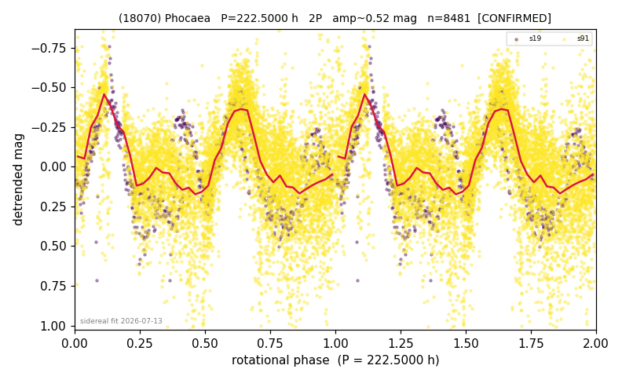

# (18070)

**Adopted:** 222.5 h, 2P, CONFIRMED

<!-- AUTO:START (regenerated from pipeline outputs; do not hand-edit this block) -->
## Evidence (auto)

Detected in 2 sector(s):

| sector | N | baseline (h) | P_phot (h) | power | FAP | cycles | flags |
|--|--|--|--|--|--|--|--|
| s19 | 841 | 586.5 | 106.3594 | 0.4076 | 2.0e-91 | 5.5 | 2P-ambiguous |
| s91 | 7706 | 650.4 | 109.6233 | 0.3315 | 0.0e+00 | 5.9 | star-cleaned:67,2P-ambiguous |

- Pipeline refine said: **2P** (folded amp_fourier 0.474); flags: amp-from-clean-sectors(ignored s91);near-comb(amp-cleared):n=3;few-cycle:3.0;gap-alias-ris
- DIA (de-comb): survived_v2(ret=0.893[0.79-0.97],s19@107.991h)
- Coverage: **2 sector(s)**, best sector covers **2.92 cycles** of the adopted period. Measured periodogram peak width 18% of the period, i.e. about **+/- 8.335 h** (1 sigma); the decimal places in the adopted value are not a precision claim.
- Factor of two: **adopted on the amplitude convention**: standard practice for an elongated body, but a convention rather than a measurement.
- Gates: FAP<1e-3 and power>=0.10 per detecting sector; >=2 sectors agree (harmonic-aware).
- Adopted shape: **2P** (folded-amplitude rule; pipeline agrees).

### Why this row reads the way it does

- SUPER-SLOW; multi-year sidereal confirmation vs comb 109.6h; c=-1.1; P doubled 2026-07-25 (doubling audit: amp>=0.25 + Harris convention)

<!-- AUTO:END -->

## Reasoning
SUPER-SLOW. Multi-year sidereal confirmation (PAB epoch, c=-1.1 non-zero -> body-fixed, not comb) vs the 109.6 h comb line. Re-pass refine wanted 216 h; sidereal anchor wins.
## Verdict
CONFIRMED 2P / 222.5 h.

2026-08-15 addendum: verdict updated; 2026-07-25 resolution: the old 'sidereal anchor wins' argument compared a FIXED 223.4 h against an OPTIMISED 111.660 h and is invalid; PDM Theta is structurally agnostic between P and 2P (222.500 h Theta 0.471 vs 111.660 h 0.468), so the amplitude convention governs -> 222.5 h.
