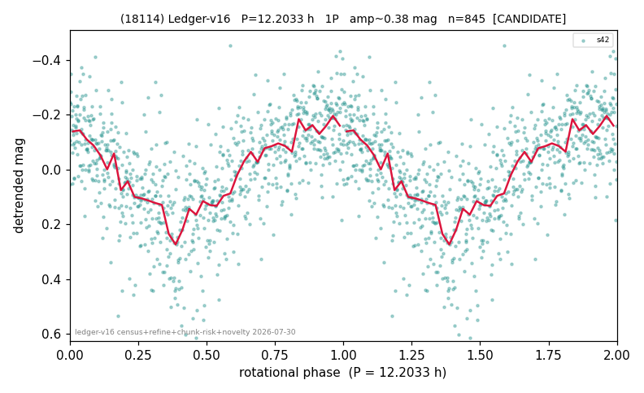

# (18114)

**Adopted:** 12.2033 h, 1P, CANDIDATE

<!-- AUTO:START (regenerated from pipeline outputs; do not hand-edit this block) -->
## Evidence (auto)

Detected in 1 sector(s):

| sector | N | baseline (h) | P_phot (h) | power | FAP | cycles | flags |
|--|--|--|--|--|--|--|--|
| s42 | 855 | 369.3 | 12.2033 | 0.4399 | 3.0e-103 | 30.3 | star-cleaned:11,2P-ambiguous |

- Pipeline refine said: **1P** (folded amp_fourier 0.375); flags: sick-dips-excised:s42(2);near-threshold:0.37
- DIA (de-comb): survived(dPW=+6%,R2=0.06,s42@12.203h,1sec)
- Coverage: **1 sector(s)**, best sector covers **30.27 cycles** of the adopted period. Measured periodogram peak width 2% of the period, i.e. about **+/- 0.13 h** (1 sigma); the decimal places in the adopted value are not a precision claim.
- Factor of two: no doubling was applied.
- Gates: FAP<1e-3 and power>=0.10 per detecting sector; single strong sector (candidate ceiling).
- Adopted shape: **1P** (folded-amplitude rule; pipeline agrees).

### Why this row reads the way it does

- 1 sector(s) detecting
- single-peaked at folded amp 0.375 mag

<!-- AUTO:END -->
