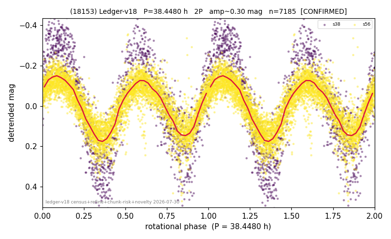

# (18153)

**Adopted:** 38.448 h, 2P, CONFIRMED

<!-- AUTO:START (regenerated from pipeline outputs; do not hand-edit this block) -->
## Evidence (auto)

Detected in 2 sector(s):

| sector | N | baseline (h) | P_phot (h) | power | FAP | cycles | flags |
|--|--|--|--|--|--|--|--|
| s38 | 1449 | 364.2 | 19.2135 | 0.7842 | 0.0e+00 | 19.0 | 2P-ambiguous |
| s56 | 5764 | 385.7 | 19.2355 | 0.7021 | 0.0e+00 | 20.1 | star-cleaned:20,2P-ambiguous |

- Pipeline refine said: **2P** (folded amp_fourier 0.623); flags: sick-dips-excised:s56(5)
- DIA (de-comb): **NOT RUN for this lot.** No de-comb verdict exists for this object, so momentum-dump contamination has not been excluded by that test here.
- Gates: FAP<1e-3 and power>=0.10 per detecting sector; >=2 sectors agree (harmonic-aware).
- Adopted shape: **2P** (folded-amplitude rule; pipeline agrees).

### Why this row reads the way it does

- 2 sector(s) detecting
- cross-sector fold correlation 0.98
- doubling BY CONVENTION: amplitude rule on folded amp 0.623 mag, not individually audited

<!-- AUTO:END -->
