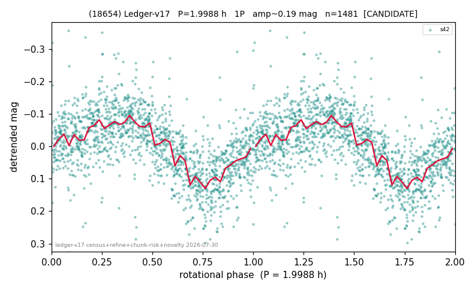

# (18654)

**Adopted:** 3.9976 h, 2P, CANDIDATE

<!-- AUTO:START (regenerated from pipeline outputs; do not hand-edit this block) -->
## Evidence (auto)

Detected in 1 sector(s):

| sector | N | baseline (h) | P_phot (h) | power | FAP | cycles | flags |
|--|--|--|--|--|--|--|--|
| s42 | 1508 | 467.0 | 1.9988 | 0.3841 | 2.3e-154 | 233.6 | star-cleaned:15,2P-ambiguous |

- Pipeline refine said: **1P** (folded amp_fourier 0.189); flags: sick-dips-excised:s42(10)
- DIA (de-comb): not triggered (clean, fast, non-comb)
- Gates: FAP<1e-3 and power>=0.10 per detecting sector; single strong sector (candidate ceiling).
- **Adopted shape 2P OVERRIDES the pipeline's 1P** (doubling audit 2026-07-25: folded amplitude >= 0.25 mag, so a single-peaked curve is physically implausible; Harris convention -> 2P. The census 3-test doubling logic was measured at only 30% recall against 289 LCDB U>=2 ground-truth periods).

### Why this row reads the way it does

- 1 sector(s) detecting
- single-peaked at folded amp 0.189 mag
- CORRECTED 1.9988->3.9976 h (2026-08-01 sub-barrier sweep): all 49 catalog periods below 2.2 h sat on 5-16 km bodies, impossible as true rotations; doubling by SPIN-BARRIER PHYSICS: fold symmetric (photometry cannot decide), but a D~8 km body cannot rotate below the 2.2 h rubble-pile barrier, so the single-peaked reading is physically excluded

<!-- AUTO:END -->
