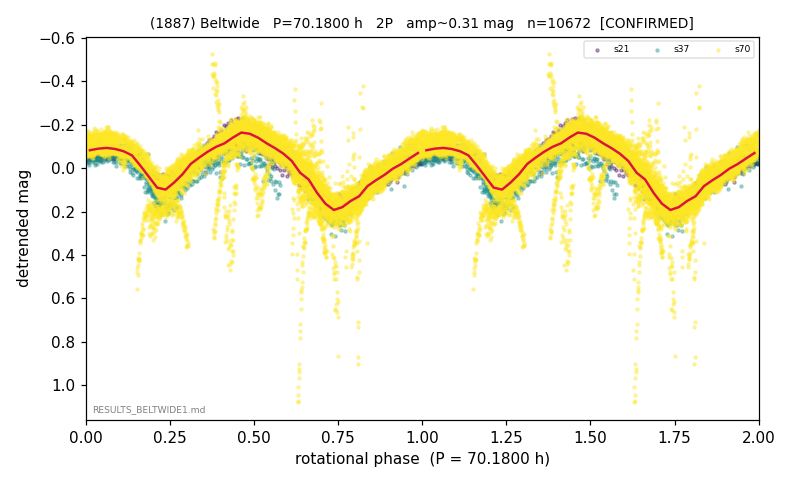

# (1887)

**Adopted:** 70.18 h, 2P, CONFIRMED

<!-- AUTO:START (regenerated from pipeline outputs; do not hand-edit this block) -->
## Evidence (auto)

Detected in 3 sector(s):

| sector | N | baseline (h) | P_phot (h) | power | FAP | cycles | flags |
|--|--|--|--|--|--|--|--|
| s21 | 892 | 627.5 | 35.1326 | 0.5124 | 1.2e-134 | 8.9 | clean |
| s37 | 1338 | 256.0 | 35.0337 | 0.6226 | 4.0e-278 | 3.7 | clean |
| s70 | 8442 | 600.9 | 35.0922 | 0.5289 | 0.0e+00 | 8.6 | star-cleaned:14 |

- Pipeline refine said: **1P** (folded amp_fourier 0.33); flags: clean
- DIA (de-comb): survived(dPW=+6%,R2=0.26,s37@35.092h,7sec)
- Gates: FAP<1e-3 and power>=0.10 per detecting sector; >=2 sectors agree (harmonic-aware).
- **Adopted shape 2P OVERRIDES the pipeline's 1P** (doubling audit 2026-07-25: folded amplitude >= 0.25 mag, so a single-peaked curve is physically implausible; Harris convention -> 2P. The census 3-test doubling logic was measured at only 30% recall against 289 LCDB U>=2 ground-truth periods).

### Why this row reads the way it does

- arbitration: matches Durech 70.17h; doubling by multi-evidence; P_sid=70.11h Theta=0.366

<!-- AUTO:END -->

## Reasoning
Arbitration: matches Durech 70.17 h inversion; P_sid=70.11 h Theta=0.366. Refine wanted 35 h (1P); literature + sidereal anchor.
## Verdict
CONFIRMED 2P / 70.18 h.
