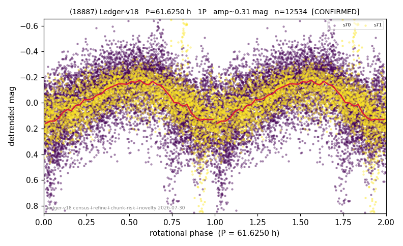

# (18887)

**Adopted:** 61.625 h, 1P, CONFIRMED

<!-- AUTO:START (regenerated from pipeline outputs; do not hand-edit this block) -->
## Evidence (auto)

Detected in 2 sector(s):

| sector | N | baseline (h) | P_phot (h) | power | FAP | cycles | flags |
|--|--|--|--|--|--|--|--|
| s70 | 8872 | 599.0 | 61.8993 | 0.2934 | 0.0e+00 | 9.7 | star-cleaned:103,2P-ambiguous |
| s71 | 3776 | 259.7 | 61.3506 | 0.3628 | 0.0e+00 | 4.2 | star-cleaned:59,2P-ambiguous |

- Pipeline refine said: **1P** (folded amp_fourier 0.351); flags: sick-dips-excised:s70(18),s71(10);near-threshold:0.35
- DIA (de-comb): not triggered (clean, fast, non-comb)
- Gates: FAP<1e-3 and power>=0.10 per detecting sector; >=2 sectors agree (harmonic-aware).
- Adopted shape: **1P** (folded-amplitude rule; pipeline agrees).

### Why this row reads the way it does

- 2 sector(s) detecting
- cross-sector fold correlation 0.88
- single-peaked at folded amp 0.351 mag

<!-- AUTO:END -->
