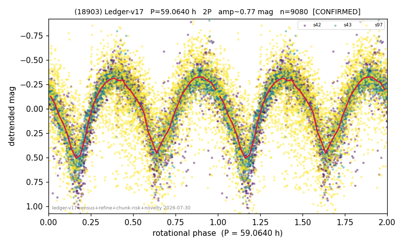

# (18903)

**Adopted:** 59.064 h, 2P, CONFIRMED

<!-- AUTO:START (regenerated from pipeline outputs; do not hand-edit this block) -->
## Evidence (auto)

Detected in 3 sector(s):

| sector | N | baseline (h) | P_phot (h) | power | FAP | cycles | flags |
|--|--|--|--|--|--|--|--|
| s42 | 2706 | 611.1 | 29.5315 | 0.6948 | 0.0e+00 | 20.7 | star-cleaned:9,2P-ambiguous |
| s43 | 2499 | 575.2 | 29.5334 | 0.8207 | 0.0e+00 | 19.5 | 2P-ambiguous |
| s97 | 4001 | 307.0 | 29.3237 | 0.2893 | 8.9e-292 | 10.5 | star-cleaned:5,2P-ambiguous |

- Pipeline refine said: **2P** (folded amp_fourier 0.83); flags: near-comb(amp-cleared):n=11;gap-alias-risk:71h;sick-dips-excised:s42(20),s43(8),s97(23)
- DIA (de-comb): not triggered (clean, fast, non-comb)
- Gates: FAP<1e-3 and power>=0.10 per detecting sector; >=2 sectors agree (harmonic-aware).
- Adopted shape: **2P** (folded-amplitude rule; pipeline agrees).

### Why this row reads the way it does

- 3 sector(s) detecting
- cross-sector fold correlation 0.98
- doubling BY CONVENTION: amplitude rule on folded amp 0.830 mag, not individually audited

<!-- AUTO:END -->
