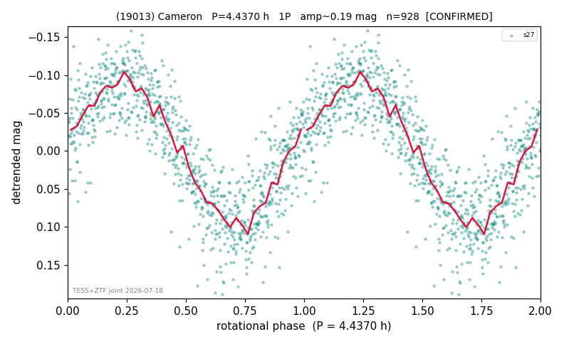

# (19013)

**Adopted:** 4.437 h, 1P, CONFIRMED

<!-- AUTO:START (regenerated from pipeline outputs; do not hand-edit this block) -->
## Evidence (auto)

Detected in 1 sector(s):

| sector | N | baseline (h) | P_phot (h) | power | FAP | cycles | flags |
|--|--|--|--|--|--|--|--|
| s27 | 928 | 180.3 | 4.4372 | 0.7603 | 1.3e-282 | 40.6 | 2P-ambiguous |

- Pipeline refine said: **1P** (folded amp_fourier 0.191); flags: clean
- DIA (de-comb): not triggered (clean, fast, non-comb)
- Gates: FAP<1e-3 and power>=0.10 per detecting sector; >=2 sectors agree (harmonic-aware).
- Adopted shape: **1P** (folded-amplitude rule; pipeline agrees).

### Why this row reads the way it does

- ZTF blind recovery FAP 1.15e-20 (5.4yr) + alias-fan decomposition; TESS 1P clean

<!-- AUTO:END -->
