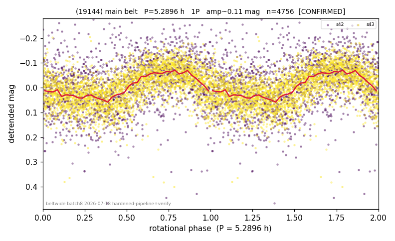

# (19144)

**Adopted:** 5.2896 h, 1P, CONFIRMED

<!-- AUTO:START (regenerated from pipeline outputs; do not hand-edit this block) -->
## Evidence (auto)

Detected in 2 sector(s):

| sector | N | baseline (h) | P_phot (h) | power | FAP | cycles | flags |
|--|--|--|--|--|--|--|--|
| s42 | 1819 | 449.7 | 5.2896 | 0.1193 | 5.0e-46 | 85.0 | star-cleaned:9,2P-ambiguous |
| s43 | 2946 | 593.2 | 5.2897 | 0.2998 | 3.3e-223 | 112.1 | 2P-ambiguous |

- Refined shape: **1P** (folded amp_fourier 0.127); flags: sector-dropped:s42(range>3mag);sick-dips-excised:s43(1)
- DIA (de-comb): inconclusive(dPW=+15%,R2=0.57,s43@5.290h)
- Gates: FAP<1e-3 and power>=0.10 per detecting sector; >=2 sectors agree (harmonic-aware); folded-amplitude rule -> 1P.

<!-- AUTO:END -->
