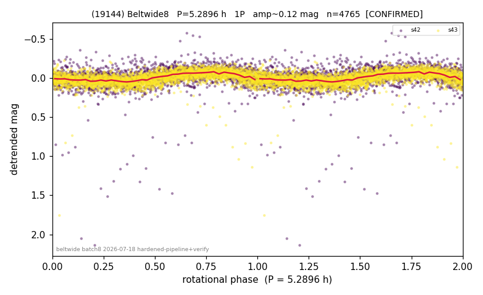

# (19144)

**Adopted:** 5.2896 h, 1P, CONFIRMED

<!-- AUTO:START (regenerated from pipeline outputs; do not hand-edit this block) -->
## Evidence (auto)

Detected in 2 sector(s):

| sector | N | baseline (h) | P_phot (h) | power | FAP | cycles | flags |
|--|--|--|--|--|--|--|--|
| s42 | 1819 | 449.7 | 5.2896 | 0.1193 | 5.0e-46 | 85.0 | star-cleaned:9,2P-ambiguous |
| s43 | 2946 | 593.2 | 5.2897 | 0.2998 | 3.3e-223 | 112.1 | 2P-ambiguous |

- Pipeline refine said: **1P** (folded amp_fourier 0.132); flags: sick-dips-excised:s42(2),s43(1);harmonic-only-agreement:s42(pw=0.07)
- DIA (de-comb): inconclusive(dPW=+15%,R2=0.57,s43@5.290h)
- Gates: FAP<1e-3 and power>=0.10 per detecting sector; >=2 sectors agree (harmonic-aware).
- Adopted shape: **1P** (folded-amplitude rule; pipeline agrees).

### Why this row reads the way it does

- folded_amp=0.117. s42 (P=5.2896h, FAP=5e-46) and s43 (P=5.2897h, FAP=3e-223) independently agree to 4 decimal places; folded ridge amplitude 0.117 mag (well under 0.40) with a clean single-humped profile, not phase-locked double minima, c

<!-- AUTO:END -->
