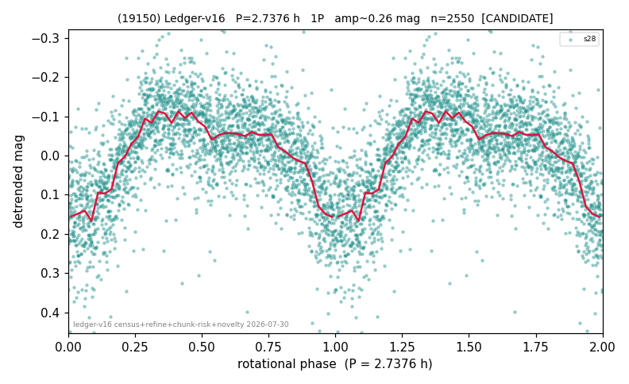

# (19150)

**Adopted:** 5.4752 h, 2P, CANDIDATE

<!-- AUTO:START (regenerated from pipeline outputs; do not hand-edit this block) -->
## Evidence (auto)

Detected in 1 sector(s):

| sector | N | baseline (h) | P_phot (h) | power | FAP | cycles | flags |
|--|--|--|--|--|--|--|--|
| s28 | 2552 | 550.0 | 2.7376 | 0.4245 | 3.0e-301 | 200.9 | 2P-ambiguous |

- Pipeline refine said: **1P** (folded amp_fourier 0.24); flags: clean
- DIA (de-comb): **NOT RUN for this lot.** No de-comb verdict exists for this object, so momentum-dump contamination has not been excluded by that test here.
- Gates: FAP<1e-3 and power>=0.10 per detecting sector; single strong sector (candidate ceiling).
- **Adopted shape 2P OVERRIDES the pipeline's 1P** (doubling audit 2026-07-25: folded amplitude >= 0.25 mag, so a single-peaked curve is physically implausible; Harris convention -> 2P. The census 3-test doubling logic was measured at only 30% recall against 289 LCDB U>=2 ground-truth periods).

### Why this row reads the way it does

- 1 sector(s) detecting
- single-peaked at folded amp 0.240 mag
- CORRECTED 2.7376->5.4752 h (2026-08-02 full 1P re-audit): doubling MEASURED at odd-harmonic 13.8 sigma with ALL detecting sectors significant (1/1); threshold odd>=8+full-reproduction calibrated to 0/60 false fires on the 4P null test (the minima-asymmetry branch alone fired falsely at z up to 34 and is not accepted)

<!-- AUTO:END -->
