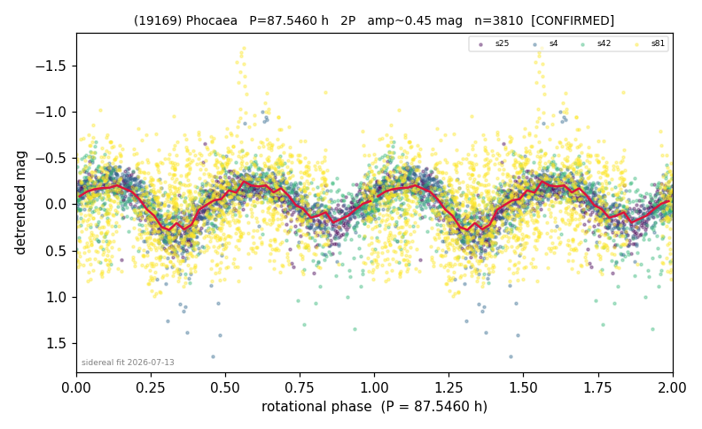

# (19169)

**Adopted:** 87.546 h, 2P, CONFIRMED

<!-- AUTO:START (regenerated from pipeline outputs; do not hand-edit this block) -->
## Evidence (auto)

Detected in 4 sector(s):

| sector | N | baseline (h) | P_phot (h) | power | FAP | cycles | flags |
|--|--|--|--|--|--|--|--|
| s4 | 818 | 620.5 | 43.9384 | 0.5831 | 7.3e-151 | 14.1 | star-cleaned:2,2P-ambiguous |
| s25 | 761 | 488.5 | 43.7729 | 0.623 | 1.3e-156 | 11.2 | 2P-ambiguous |
| s42 | 608 | 148.3 | 42.8757 | 0.2965 | 7.1e-43 | 3.5 | star-cleaned:2,2P-untestable,2P-ambiguou |
| s81 | 1623 | 270.3 | 41.4126 | 0.0762 | 4.3e-24 | 6.5 | star-cleaned:25 |

- Refined shape: **2P** (folded amp_fourier 0.625); flags: gap-alias-risk:69h;sick-dips-excised:s4(4),s42(1)
- DIA (de-comb): survived(dPW=+5%,R2=0.18,s25@43.773h,5sec)
- Gates: FAP<1e-3 and power>=0.10 per detecting sector; >=2 sectors agree (harmonic-aware); folded-amplitude rule -> 2P.

<!-- AUTO:END -->

## Sidereal phase-connection (2026-07-19)
5.8-yr baseline (s4, s25, s42, s81; 963 binned pts): best P_sid = 88.000 h, c = -1.45,
PDM Theta = 0.509. Just above the Theta <= 0.47 confirmation bar, so SUPPORTED rather than
sidereally confirmed, but strongly so: agrees with the adopted 87.546 h to 0.5%, the non-zero
c term is a body-fixed signature (comb lines can only fold at c = 0), and every momentum-dump
comb line scores far worse (Theta 0.91-0.97). Plot: tess-phocaea/sidereal_19169.png.
