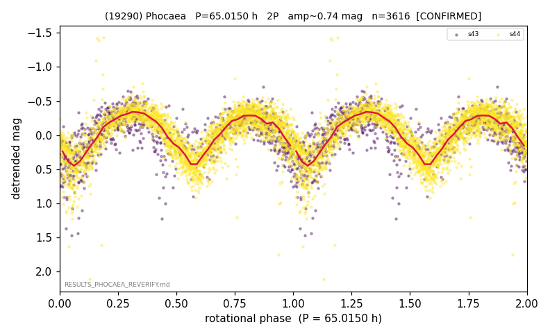

# (19290)

**Adopted:** 65.015 h, 2P, CONFIRMED

<!-- AUTO:START (regenerated from pipeline outputs; do not hand-edit this block) -->
## Evidence (auto)

Detected in 2 sector(s):

| sector | N | baseline (h) | P_phot (h) | power | FAP | cycles | flags |
|--|--|--|--|--|--|--|--|
| s43 | 894 | 168.8 | 32.4272 | 0.4976 | 2.9e-129 | 2.6 | clean |
| s44 | 2722 | 580.7 | 32.5879 | 0.5992 | 0.0e+00 | 17.8 | star-cleaned:4,2P-ambiguous |

- Refined shape: **2P** (folded amp_fourier 0.657); flags: near-comb(amp-cleared):n=5,10;few-cycle:2.6;sector-dropped:s44(range>3mag);sick-dips-excis
- DIA (de-comb): survived(dPW=+3%,R2=0.15,s44@32.508h,4sec)
- Gates: FAP<1e-3 and power>=0.10 per detecting sector; >=2 sectors agree (harmonic-aware); folded-amplitude rule -> 2P.

<!-- AUTO:END -->
