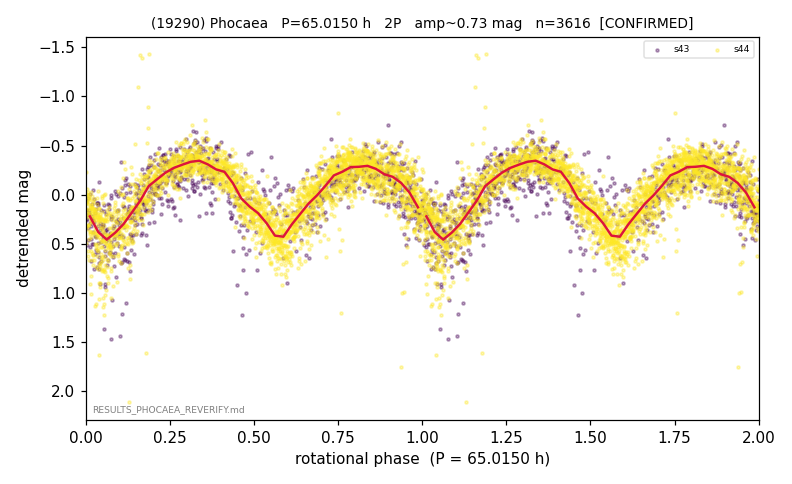

# (19290)

**Adopted:** 65.015 h, 2P, CONFIRMED

<!-- AUTO:START (regenerated from pipeline outputs; do not hand-edit this block) -->
## Evidence (auto)

Detected in 2 sector(s):

| sector | N | baseline (h) | P_phot (h) | power | FAP | cycles | flags |
|--|--|--|--|--|--|--|--|
| s43 | 894 | 168.8 | 32.4272 | 0.4976 | 2.9e-129 | 2.6 | clean |
| s44 | 2722 | 580.7 | 32.5879 | 0.5992 | 0.0e+00 | 17.8 | star-cleaned:4,2P-ambiguous |

- Pipeline refine said: **2P** (folded amp_fourier 0.766); flags: near-comb(amp-cleared):n=5,10;sick-dips-excised:s43(2),s44(6)
- DIA (de-comb): survived_v2(ret=0.990[0.99-0.99],s44@32.508h)
- Coverage: **2 sector(s)**, best sector covers **8.93 cycles** of the adopted period. Measured periodogram peak width 5% of the period, i.e. about **+/- 0.6814 h** (1 sigma); the decimal places in the adopted value are not a precision claim.
- Factor of two: **adopted on the amplitude convention**: standard practice for an elongated body, but a convention rather than a measurement.
- Gates: FAP<1e-3 and power>=0.10 per detecting sector; >=2 sectors agree (harmonic-aware).
- Adopted shape: **2P** (folded-amplitude rule; pipeline agrees).

### Why this row reads the way it does

- amp 0.77; consecutive sectors, no sidereal possible
- 2P by amplitude rule (folded_amp=0.766)

<!-- AUTO:END -->
