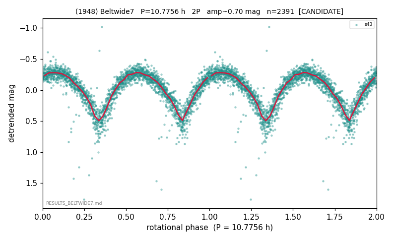

# (1948)

**Adopted:** 10.7722 h, 2P, CANDIDATE

<!-- AUTO:START (regenerated from pipeline outputs; do not hand-edit this block) -->
## Evidence (auto)

Detected in 1 sector(s):

| sector | N | baseline (h) | P_phot (h) | power | FAP | cycles | flags |
|--|--|--|--|--|--|--|--|
| s43 | 2391 | 587.0 | 5.3861 | 0.768 | 0.0e+00 | 109.0 | star-cleaned:14,2P-ambiguous |

- Pipeline refine said: **2P** (folded amp_fourier 0.689); flags: sick-dips-excised:s43(8)
- DIA (de-comb): survived(dPW=-1%,R2=0.15,s43@5.386h,2sec)
- Gates: FAP<1e-3 and power>=0.10 per detecting sector; single strong sector (candidate ceiling).
- Adopted shape: **2P** (folded-amplitude rule; pipeline agrees).

### Why this row reads the way it does

- s43 only sector, n=2391, baseline=587h. LS base P=5.386h pw=0.77 FAP=0; PDM independently=10.773h, matches 2xLS (2P). Folded amp=0.81mag>>0.

<!-- AUTO:END -->
