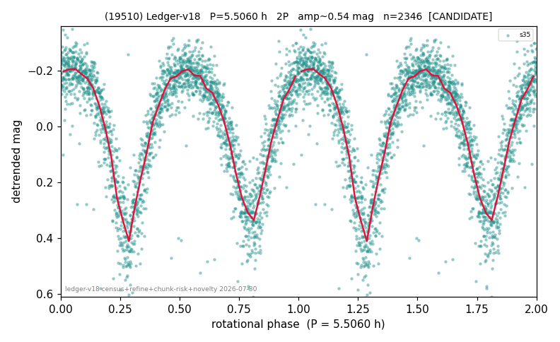

# (19510)

**Adopted:** 5.506 h, 2P, CANDIDATE

<!-- AUTO:START (regenerated from pipeline outputs; do not hand-edit this block) -->
## Evidence (auto)

Detected in 1 sector(s):

| sector | N | baseline (h) | P_phot (h) | power | FAP | cycles | flags |
|--|--|--|--|--|--|--|--|
| s35 | 2359 | 589.2 | 2.753 | 0.7343 | 0.0e+00 | 214.0 | star-cleaned:4,2P-ambiguous |

- Pipeline refine said: **2P** (folded amp_fourier 0.513); flags: sick-dips-excised:s35(9)
- DIA (de-comb): not triggered (clean, fast, non-comb)
- Gates: FAP<1e-3 and power>=0.10 per detecting sector; single strong sector (candidate ceiling).
- Adopted shape: **2P** (folded-amplitude rule; pipeline agrees).

### Why this row reads the way it does

- 1 sector(s) detecting
- doubling BY CONVENTION: amplitude rule on folded amp 0.513 mag, not individually audited

<!-- AUTO:END -->
