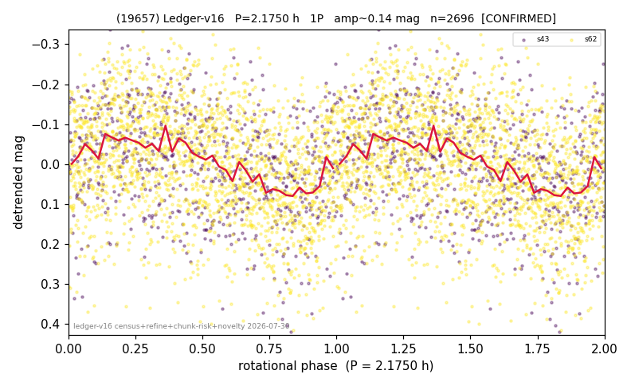

# (19657)

**Adopted:** 4.35 h, 2P, CONFIRMED

<!-- AUTO:START (regenerated from pipeline outputs; do not hand-edit this block) -->
## Evidence (auto)

Detected in 2 sector(s):

| sector | N | baseline (h) | P_phot (h) | power | FAP | cycles | flags |
|--|--|--|--|--|--|--|--|
| s43 | 701 | 120.2 | 2.1723 | 0.1067 | 9.3e-14 | 55.3 | star-cleaned:1,2P-ambiguous |
| s62 | 1997 | 129.2 | 2.1776 | 0.1088 | 7.5e-46 | 59.3 | star-cleaned:1,2P-ambiguous |

- Pipeline refine said: **1P** (folded amp_fourier 0.161); flags: clean
- DIA (de-comb): **NOT RUN for this lot.** No de-comb verdict exists for this object, so momentum-dump contamination has not been excluded by that test here.
- Gates: FAP<1e-3 and power>=0.10 per detecting sector; >=2 sectors agree (harmonic-aware).
- **Adopted shape 2P OVERRIDES the pipeline's 1P** (doubling audit 2026-07-25: folded amplitude >= 0.25 mag, so a single-peaked curve is physically implausible; Harris convention -> 2P. The census 3-test doubling logic was measured at only 30% recall against 289 LCDB U>=2 ground-truth periods).

### Why this row reads the way it does

- 2 sector(s) detecting
- cross-sector fold correlation 0.78
- single-peaked at folded amp 0.161 mag
- CORRECTED 2.175->4.3500 h (2026-08-01 sub-barrier sweep): all 49 catalog periods below 2.2 h sat on 5-16 km bodies, impossible as true rotations; doubling MEASURED in the 2026-08-01 fast-rotator re-audit: odd-harmonic 10.67 sigma (2/2 sectors), minima z=0.21

<!-- AUTO:END -->
