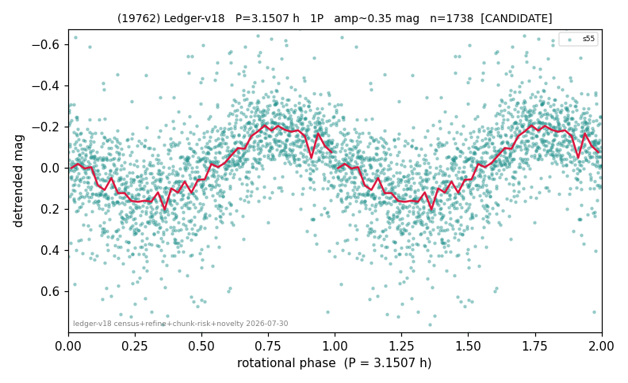

# (19762)

**Adopted:** 3.1507 h, 1P, CANDIDATE

<!-- AUTO:START (regenerated from pipeline outputs; do not hand-edit this block) -->
## Evidence (auto)

Detected in 1 sector(s):

| sector | N | baseline (h) | P_phot (h) | power | FAP | cycles | flags |
|--|--|--|--|--|--|--|--|
| s55 | 1757 | 630.8 | 3.1507 | 0.3089 | 1.1e-136 | 200.2 | 2P-ambiguous |

- Pipeline refine said: **1P** (folded amp_fourier 0.385); flags: sick-dips-excised:s55(7);near-threshold:0.38
- DIA (de-comb): not triggered (clean, fast, non-comb)
- Gates: FAP<1e-3 and power>=0.10 per detecting sector; single strong sector (candidate ceiling).
- Adopted shape: **1P** (folded-amplitude rule; pipeline agrees).

### Why this row reads the way it does

- 1 sector(s) detecting
- single-peaked at folded amp 0.385 mag

<!-- AUTO:END -->
