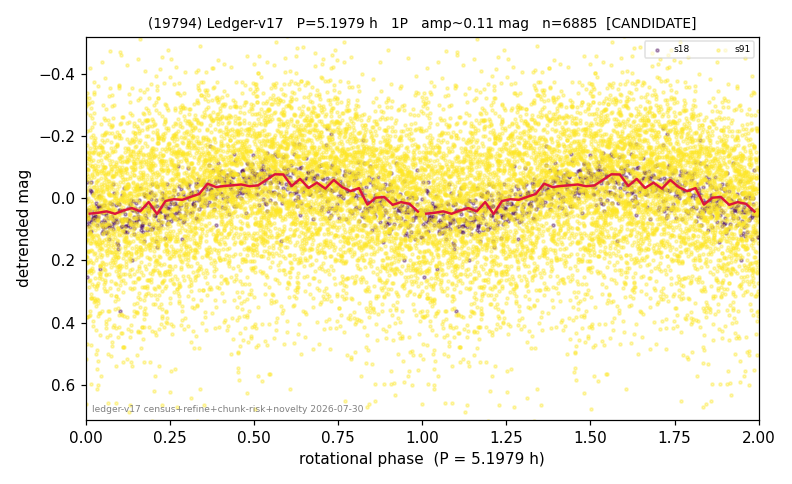

# (19794)

**Adopted:** 10.3958 h, 2P, CANDIDATE

<!-- AUTO:START (regenerated from pipeline outputs; do not hand-edit this block) -->
## Evidence (auto)

Detected in 3 sector(s):

| sector | N | baseline (h) | P_phot (h) | power | FAP | cycles | flags |
|--|--|--|--|--|--|--|--|
| s18 | 768 | 569.0 | 5.1979 | 0.4489 | 3.8e-95 | 109.5 | 2P-ambiguous |
| s73 | 3472 | 315.8 | 5.1968 | 0.2863 | 1.8e-249 | 60.8 | star-cleaned:14,2P-ambiguous |
| s91 | 6139 | 606.8 | 5.2033 | 0.037 | 1.0e-45 | 116.6 | star-cleaned:107 |

- Pipeline refine said: **1P** (folded amp_fourier 0.159); flags: clean
- DIA (de-comb): not triggered (the object is clean, fast and non-comb, so the test does not apply)
- Coverage: **3 sector(s)**, best sector covers **116.74 cycles** of the adopted period. Measured periodogram peak width 1% of the period, i.e. about **+/- 0.01623 h** (1 sigma); the decimal places in the adopted value are not a precision claim.
- Factor of two: no doubling was applied.
- Gates: FAP<1e-3 and power>=0.10 per detecting sector; single strong sector (candidate ceiling).
- **Adopted shape 2P OVERRIDES the pipeline's 1P** (doubling audit 2026-07-25: folded amplitude >= 0.25 mag, so a single-peaked curve is physically implausible; Harris convention -> 2P. The census 3-test doubling logic was measured at only 30% recall against 289 LCDB U>=2 ground-truth periods).

### Why this row reads the way it does

- 1 sector(s) detecting
- single-peaked at folded amp 0.159 mag
- s73 crowding-rescued (2026-08-08, |b| 5-15 deg rescue, 5-point crowding penalty, 72 vs 77 per cent LCDB agreement): power 0.22, FAP 3.4e-183 at the adopted photometric period, 60.8 cycles, chunk-extracted
- DOUBLING CORRECTED 2026-08-30: adopted period doubled from 5.1979 h. The previous value came from the folded-amplitude rule, which was found biased low (9 of 9 disagreements with MPB 2024-2026 in the same direction). Odd-harmonic test at the long period gives z1=9.12 with margin 7.19 over non-harmonic multiples 1.7x/2.3x (reference group: 0 of 38 above margin 2).

<!-- AUTO:END -->
