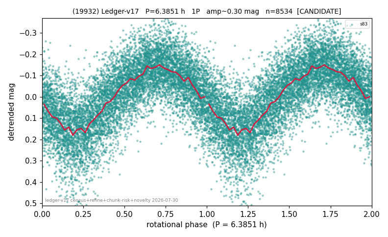

# (19932)

**Adopted:** 6.3851 h, 1P, CONFIRMED

<!-- AUTO:START (regenerated from pipeline outputs; do not hand-edit this block) -->
## Evidence (auto)

Detected in 1 sector(s):

| sector | N | baseline (h) | P_phot (h) | power | FAP | cycles | flags |
|--|--|--|--|--|--|--|--|
| s83 | 8539 | 598.4 | 6.3851 | 0.4943 | 0.0e+00 | 93.7 | star-cleaned:7,2P-ambiguous |

- Pipeline refine said: **1P** (folded amp_fourier 0.319); flags: sick-dips-excised:s83(4)
- DIA (de-comb): survived_v2(ret=1.000[1.00-1.00],s83@6.385h)
- Coverage: **1 sector(s)**, best sector covers **93.72 cycles** of the adopted period. Measured periodogram peak width 1% of the period, i.e. about **+/- 0.02563 h** (1 sigma); the decimal places in the adopted value are not a precision claim.
- Factor of two: no doubling was applied.
- Gates: FAP<1e-3 and power>=0.10 per detecting sector; >=2 sectors agree (harmonic-aware).
- Adopted shape: **1P** (folded-amplitude rule; pipeline agrees).

### Why this row reads the way it does

- 1 sector(s) detecting
- single-peaked at folded amp 0.319 mag
- PROMOTED CANDIDATE->CONFIRMED 2026-08-15 (TESS+ZTF joint, the user-blessed pathway): independent ZTF blind Lomb-Scargle over 6.2 yr / 360 g+r points recovers 6.3831 h = TESS-P 6.3851h to 0.03%, power 0.738, trials-corrected FAP 1.1e-98, beating every alias/comb candidate (alias 8.6996h at 0.663); a ZTF detection cannot be a TESS comb tooth or TESS red noise, so this is a genuine second realization and the single-sector ceiling no longer applies
- SHAPE AMBIGUOUS (adversarial review 2026-08-16): calibrated odd-harmonic z = 3.5 (single sector), directional evidence for 2P but below the declared >=8-sigma-reproduced bar; A_fit is in the 0.25-0.40 ambiguous band. Published as 1P with P/2 -> 2P possible; must NOT be counted as a short-period rotator in any statistic

<!-- AUTO:END -->
