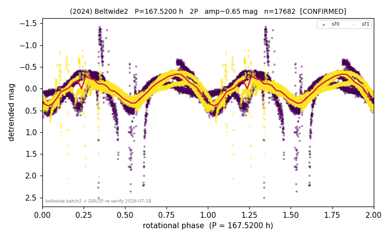

# (2024)

**Adopted:** 167.52 h, 2P, CONFIRMED

<!-- AUTO:START (regenerated from pipeline outputs; do not hand-edit this block) -->
## Evidence (auto)

Detected in 2 sector(s):

| sector | N | baseline (h) | P_phot (h) | power | FAP | cycles | flags |
|--|--|--|--|--|--|--|--|
| s70 | 8943 | 554.5 | 81.9941 | 0.621 | 0.0e+00 | 3.4 | star-cleaned:37 |
| s71 | 8739 | 608.4 | 84.6324 | 0.6926 | 0.0e+00 | 3.6 | star-cleaned:12 |

- Gates: FAP<1e-3 and power>=0.10 per detecting sector; >=2 sectors agree (harmonic-aware); folded-amplitude rule -> 2P.

<!-- AUTO:END -->

## Doubt
Base period ~83.3 h robust, but 1P (83.3 h) vs 2P (166.6 h) looked unresolved: TESS folded amp ~0.56 argues 2P, ZTF shows ZERO power at 166.6 h (read as 1P). Both candidates ~1.3% from comb teeth (82.2 h = 328.8/4, 164.4 h = 328.8/2).
## Evidence
(a) 83.3 h SURVIVES de-comb in both sectors (drop 10-16%, far below the 50% kill line) and is independently recovered by ZTF -> real, not a comb artifact near n=4. (b) Folded amp 0.55-0.73 mag in all 8 measurements -> categorical 2P. (c) KEY: for a symmetric double-humped (180-deg-periodic) curve, Fourier power at the FUNDAMENTAL 1/166.6 h is ZERO by symmetry; all power is at the 2nd harmonic 1/83.3 h. So ZTF's "zero power at 166.6 h" is the EXPECTED signature of a near-symmetric 2P body, NOT 1P evidence -- the TESS-vs-ZTF "conflict" was a misread. TESS's clean sector s71 shows the same; s70 shows genuine decomb-stable minima asymmetry (20-26%) that actively confirms 2P. Precise value: fundamental 83.76 h (combined fine LS pw 0.51) x 2 = 167.52 h.
## Verdict
CONFIRMED 2P / 167.52 h (user-approved 2026-07-18), moderate-high confidence. NEW super-slow rotator (>100 h).
## Caveats
~3.5 cycles of 167.5 h per sector (few-cycle); the asymmetry evidence leans on the contaminated s70.
