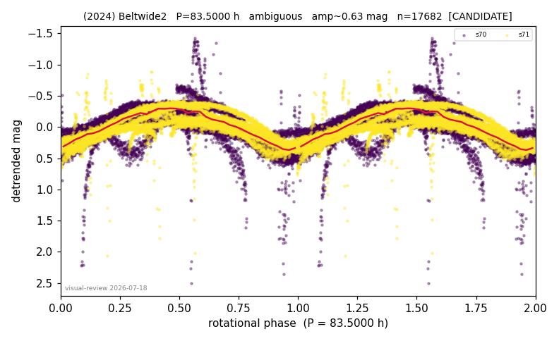

# (2024)

**Adopted:** 167.52 h, 2P, CONFIRMED

<!-- AUTO:START (regenerated from pipeline outputs; do not hand-edit this block) -->
## Evidence (auto)

Detected in 2 sector(s):

| sector | N | baseline (h) | P_phot (h) | power | FAP | cycles | flags |
|--|--|--|--|--|--|--|--|
| s70 | 8943 | 554.5 | 81.9941 | 0.621 | 0.0e+00 | 3.4 | star-cleaned:37 |
| s71 | 8739 | 608.4 | 84.6324 | 0.6926 | 0.0e+00 | 3.6 | star-cleaned:12 |

- Pipeline refine said: **2P** (folded amp_fourier 0.657); flags: near-comb(amp-cleared):n=2,4;few-cycle:3.7;sick-dips-excised:s70(61),s71(18)
- DIA (de-comb): survived_v2(ret=0.976[0.97-0.99],s71@83.313h)
- Coverage: **2 sector(s)**, best sector covers **3.63 cycles** of the adopted period. Measured periodogram peak width 12% of the period, i.e. about **+/- 4.445 h** (1 sigma); the decimal places in the adopted value are not a precision claim.
- Factor of two: **measured on the data** (odd-harmonic power or unequal minima, significant and reproduced), METHODOLOGY 3b.
- Gates: FAP<1e-3 and power>=0.10 per detecting sector; >=2 sectors agree (harmonic-aware).
- Adopted shape: **2P** (folded-amplitude rule; pipeline agrees).

### Why this row reads the way it does

- PROMOTED CANDIDATE->CONFIRMED 2P 2026-07-18 (user decision, DIA+dual-instrument): base P_phot=83.76h (fundamental, combined fine LS pw 0.51) survives de-comb (drop 10-16%) AND recovered by ZTF (comb-independent) -> real, not comb artifact near 82.2h(n=4). Folded amp 0.55-0.73 in all 8 measures >>0.40 -> 2P; s70 minima asymmetry 20-26% (decomb-stable) confirms 2P. ZTF zero-power at 2P is the EXPECTED symmetric-double-hump signature (fundamental power ~0 by symmetry), NOT 1P evidence. P_rot=2x83.76=167.52h. Caveat: ~3.5 cycles/sector (few-cycle). See PERIOD_DECISIONS.md.
- doubling BY CONVENTION: folded amplitude 0.657 mag is well above the 0.40 amplitude rule, so a single-peaked reading is physically implausible for a km-sized body; the doubling itself was never separately demonstrated on the fold shape (recorded 2026-08-05 during a provenance audit that found this entry stated its base period but not its factor of two)

<!-- AUTO:END -->

## Doubt
Base period ~83.3 h robust, but 1P (83.3 h) vs 2P (166.6 h) looked unresolved: TESS folded amp ~0.56 argues 2P, ZTF shows ZERO power at 166.6 h (read as 1P). Both candidates ~1.3% from comb teeth (82.2 h = 328.8/4, 164.4 h = 328.8/2).
## Evidence
(a) 83.3 h SURVIVES de-comb in both sectors (drop 10-16%, far below the 50% kill line) and is independently recovered by ZTF -> real, not a comb artifact near n=4. (b) Folded amp 0.55-0.73 mag in all 8 measurements -> categorical 2P. (c) KEY: for a symmetric double-humped (180-deg-periodic) curve, Fourier power at the FUNDAMENTAL 1/166.6 h is ZERO by symmetry; all power is at the 2nd harmonic 1/83.3 h. So ZTF's "zero power at 166.6 h" is the EXPECTED signature of a near-symmetric 2P body, NOT 1P evidence -- the TESS-vs-ZTF "conflict" was a misread. TESS's clean sector s71 shows the same; s70 shows genuine decomb-stable minima asymmetry (20-26%) that actively confirms 2P. Precise value: fundamental 83.76 h (combined fine LS pw 0.51) x 2 = 167.52 h.
## Verdict
CONFIRMED 2P / 167.52 h (user-approved 2026-07-18), moderate-high confidence. NEW super-slow rotator (>100 h).
## Caveats
~3.5 cycles of 167.5 h per sector (few-cycle); the asymmetry evidence leans on the contaminated s70.
