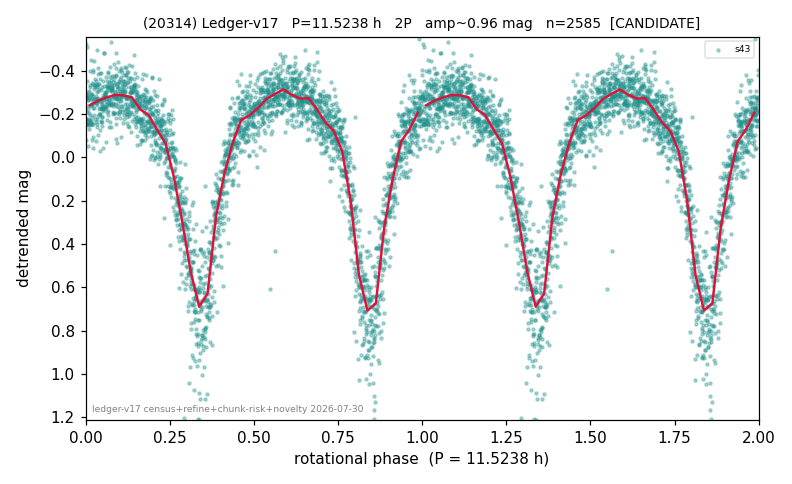

# (20314)

**Adopted:** 11.5238 h, 2P, CANDIDATE

<!-- AUTO:START (regenerated from pipeline outputs; do not hand-edit this block) -->
## Evidence (auto)

Detected in 1 sector(s):

| sector | N | baseline (h) | P_phot (h) | power | FAP | cycles | flags |
|--|--|--|--|--|--|--|--|
| s43 | 2589 | 592.2 | 5.7619 | 0.6543 | 0.0e+00 | 102.8 | 2P-ambiguous |

- Pipeline refine said: **2P** (folded amp_fourier 0.845); flags: sick-dips-excised:s43(4)
- DIA (de-comb): survived(dPW=+2%,R2=0.18,s43@5.762h,2sec)
- Gates: FAP<1e-3 and power>=0.10 per detecting sector; single strong sector (candidate ceiling).
- Adopted shape: **2P** (folded-amplitude rule; pipeline agrees).

### Why this row reads the way it does

- 1 sector(s) detecting
- doubling BY CONVENTION: amplitude rule on folded amp 0.845 mag, not individually audited

<!-- AUTO:END -->
