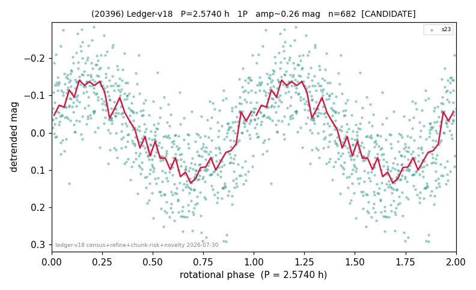

# (20396)

**Adopted:** 5.148 h, 2P, CONFIRMED

<!-- AUTO:START (regenerated from pipeline outputs; do not hand-edit this block) -->
## Evidence (auto)

Detected in 1 sector(s):

| sector | N | baseline (h) | P_phot (h) | power | FAP | cycles | flags |
|--|--|--|--|--|--|--|--|
| s23 | 682 | 591.5 | 2.574 | 0.5407 | 8.0e-111 | 229.8 | 2P-ambiguous |

- Pipeline refine said: **1P** (folded amp_fourier 0.279); flags: clean
- DIA (de-comb): not triggered (the object is clean, fast and non-comb, so the test does not apply)
- Coverage: **1 sector(s)**, best sector covers **114.9 cycles** of the adopted period. Measured periodogram peak width 0% of the period, i.e. about **+/- 0.004018 h** (1 sigma); the decimal places in the adopted value are not a precision claim.
- Factor of two: **measured on the data** (odd-harmonic power or unequal minima, significant and reproduced), METHODOLOGY 3b.
- Gates: FAP<1e-3 and power>=0.10 per detecting sector; >=2 sectors agree (harmonic-aware).
- **Adopted shape 2P OVERRIDES the pipeline's 1P** (doubling audit 2026-07-25: folded amplitude >= 0.25 mag, so a single-peaked curve is physically implausible; Harris convention -> 2P. The census 3-test doubling logic was measured at only 30% recall against 289 LCDB U>=2 ground-truth periods).

### Why this row reads the way it does

- 1 sector(s) detecting
- single-peaked at folded amp 0.279 mag
- CORRECTED 2.574->5.1480 h (2026-08-02 full 1P re-audit): doubling MEASURED at odd-harmonic 11.4 sigma with ALL detecting sectors significant (1/1); threshold odd>=8+full-reproduction calibrated to 0/60 false fires on the 4P null test (the minima-asymmetry branch alone fired falsely at z up to 34 and is not accepted)
- PROMOTED CANDIDATE->CONFIRMED 2026-08-15 (TESS+ZTF joint, the user-blessed pathway): independent ZTF blind Lomb-Scargle over 6.5 yr / 291 g+r points recovers 2.5737 h = TESS-P/2 2.5740h to 0.01%, power 0.659, trials-corrected FAP 3.3e-62, beating every alias/comb candidate (alias 2.3247h at 0.646); a ZTF detection cannot be a TESS comb tooth or TESS red noise, so this is a genuine second realization and the single-sector ceiling no longer applies

<!-- AUTO:END -->
