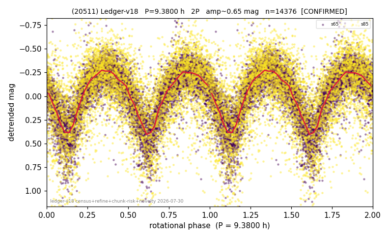

# (20511)

**Adopted:** 9.38 h, 2P, CONFIRMED

<!-- AUTO:START (regenerated from pipeline outputs; do not hand-edit this block) -->
## Evidence (auto)

Detected in 2 sector(s):

| sector | N | baseline (h) | P_phot (h) | power | FAP | cycles | flags |
|--|--|--|--|--|--|--|--|
| s65 | 8381 | 625.1 | 4.6909 | 0.5933 | 0.0e+00 | 133.3 | star-cleaned:105,2P-ambiguous |
| s85 | 6034 | 499.4 | 4.6897 | 0.2554 | 0.0e+00 | 106.5 | star-cleaned:16,2P-ambiguous |

- Pipeline refine said: **2P** (folded amp_fourier 0.635); flags: sick-dips-excised:s65(17)
- DIA (de-comb): not triggered (clean, fast, non-comb)
- Gates: FAP<1e-3 and power>=0.10 per detecting sector; >=2 sectors agree (harmonic-aware).
- Adopted shape: **2P** (folded-amplitude rule; pipeline agrees).

### Why this row reads the way it does

- 2 sector(s) detecting
- cross-sector fold correlation 0.99
- doubling BY CONVENTION: amplitude rule on folded amp 0.635 mag, not individually audited

<!-- AUTO:END -->
