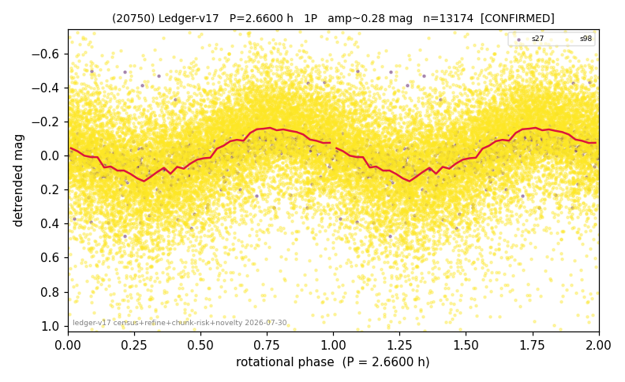

# (20750)

**Adopted:** 2.66 h, 1P, CONFIRMED

<!-- AUTO:START (regenerated from pipeline outputs; do not hand-edit this block) -->
## Evidence (auto)

Detected in 2 sector(s):

| sector | N | baseline (h) | P_phot (h) | power | FAP | cycles | flags |
|--|--|--|--|--|--|--|--|
| s27 | 841 | 194.3 | 2.6616 | 0.3493 | 2.2e-74 | 73.0 | star-cleaned:9,2P-ambiguous |
| s98 | 12378 | 918.3 | 2.659 | 0.1605 | 0.0e+00 | 345.3 | star-cleaned:64,2P-ambiguous |

- Pipeline refine said: **1P** (folded amp_fourier 0.227); flags: amp-from-clean-sectors(ignored s98);sick-dips-excised:s27(1),s98(38)
- DIA (de-comb): not triggered (clean, fast, non-comb)
- Gates: FAP<1e-3 and power>=0.10 per detecting sector; >=2 sectors agree (harmonic-aware).
- Adopted shape: **1P** (folded-amplitude rule; pipeline agrees).

### Why this row reads the way it does

- 2 sector(s) detecting
- cross-sector fold correlation 0.95
- single-peaked at folded amp 0.227 mag

<!-- AUTO:END -->
