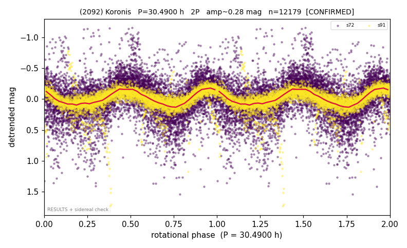

# (2092)

**Adopted:** 30.49 h, 2P, CONFIRMED

<!-- AUTO:START (regenerated from pipeline outputs; do not hand-edit this block) -->
## Evidence (auto)

Detected in 2 sector(s):

| sector | N | baseline (h) | P_phot (h) | power | FAP | cycles | flags |
|--|--|--|--|--|--|--|--|
| s72 | 7419 | 605.1 | 15.2459 | 0.2129 | 0.0e+00 | 19.8 | star-cleaned:150 |
| s91 | 4760 | 297.9 | 15.2438 | 0.4239 | 0.0e+00 | 19.5 | star-cleaned:118,2P-ambiguous |

- Pipeline refine said: **1P** (folded amp_fourier 0.239); flags: amp-from-clean-sectors(ignored s72);sick-dips-excised:s72(27),s91(3)
- DIA (de-comb): survived(dPW=+6%,R2=0.20,s91@15.245h,3sec)
- Gates: FAP<1e-3 and power>=0.10 per detecting sector; >=2 sectors agree (harmonic-aware).
- **Adopted shape 2P OVERRIDES the pipeline's 1P** (doubling audit 2026-07-25: folded amplitude >= 0.25 mag, so a single-peaked curve is physically implausible; Harris convention -> 2P. The census 3-test doubling logic was measured at only 30% recall against 289 LCDB U>=2 ground-truth periods).

<!-- AUTO:END -->
