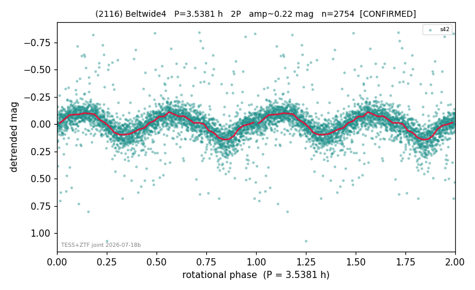

# (2116)

**Adopted:** 3.5381 h, 2P, CONFIRMED

<!-- AUTO:START (regenerated from pipeline outputs; do not hand-edit this block) -->
## Evidence (auto)

Detected in 1 sector(s):

| sector | N | baseline (h) | P_phot (h) | power | FAP | cycles | flags |
|--|--|--|--|--|--|--|--|
| s42 | 2784 | 611.1 | 1.7686 | 0.3444 | 1.9e-250 | 345.5 | star-cleaned:11,2P-ambiguous |

- Pipeline refine said: **1P** (folded amp_fourier 0.226); flags: sick-dips-excised:s42(30)
- DIA (de-comb): survived(dPW=+1%,R2=0.31,s42@1.769h,1sec)
- Coverage: **2 sector(s)**, best sector covers **242.01 cycles** of the adopted period. Measured periodogram peak width 0% of the period, i.e. about **+/- 0.001578 h** (1 sigma); the decimal places in the adopted value are not a precision claim.
- Factor of two: PHYSICS.
- Gates: FAP<1e-3 and power>=0.10 per detecting sector; >=2 sectors agree (harmonic-aware).
- **Adopted shape 2P OVERRIDES the pipeline's 1P** (doubling audit 2026-07-25: folded amplitude >= 0.25 mag, so a single-peaked curve is physically implausible; Harris convention -> 2P. The census 3-test doubling logic was measured at only 30% recall against 289 LCDB U>=2 ground-truth periods).

### Why this row reads the way it does

- TESS single-sector + ZTF STRONG_SUPPORT (recorded triage, Fink down) = 2nd realization. TESS s42: P=1.7691h, LS power=0.340, FAP=9.87e-247, no comb/alias match, clean single-sect
- 2P by spin-barrier physics (P_phot=1.7686h sub-barrier on D~23km body; single-peaked reading physically excluded)

<!-- AUTO:END -->
