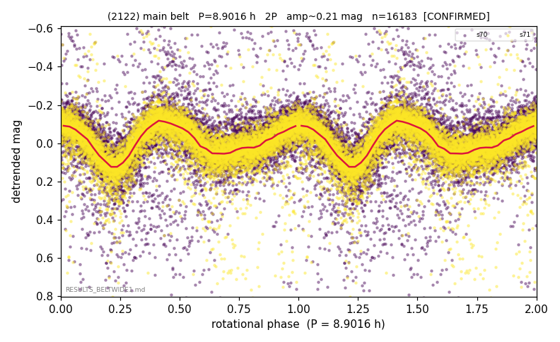

# (2122)

**Adopted:** 8.9016 h, 2P, CONFIRMED

<!-- AUTO:START (regenerated from pipeline outputs; do not hand-edit this block) -->
## Evidence (auto)

Detected in 2 sector(s):

| sector | N | baseline (h) | P_phot (h) | power | FAP | cycles | flags |
|--|--|--|--|--|--|--|--|
| s70 | 7076 | 585.5 | 4.4516 | 0.1538 | 1.4e-251 | 131.5 | star-cleaned:345,2P-ambiguous |
| s71 | 9186 | 565.6 | 4.4513 | 0.3844 | 0.0e+00 | 127.1 | star-cleaned:24,2P-ambiguous |

- Gates: FAP<1e-3 and power>=0.10 per detecting sector; >=2 sectors agree (harmonic-aware); folded-amplitude rule -> 2P.

<!-- AUTO:END -->
