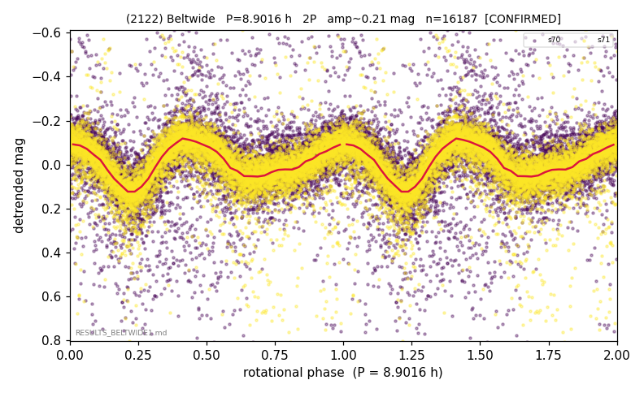

# (2122)

**Adopted:** 8.9016 h, 2P, CONFIRMED

<!-- AUTO:START (regenerated from pipeline outputs; do not hand-edit this block) -->
## Evidence (auto)

Detected in 2 sector(s):

| sector | N | baseline (h) | P_phot (h) | power | FAP | cycles | flags |
|--|--|--|--|--|--|--|--|
| s70 | 7076 | 585.5 | 4.4516 | 0.1538 | 1.4e-251 | 131.5 | star-cleaned:345,2P-ambiguous |
| s71 | 9186 | 565.6 | 4.4513 | 0.3844 | 0.0e+00 | 127.1 | star-cleaned:24,2P-ambiguous |

- Pipeline refine said: **1P** (folded amp_fourier 0.202); flags: sick-dips-excised:s70(47),s71(28);harmonic-only-agreement:s70(pw=0.08)
- DIA (de-comb): survived(dPW=+10%,R2=0.48,s71@4.451h,4sec)
- Coverage: **2 sector(s)**, best sector covers **65.78 cycles** of the adopted period. Measured periodogram peak width 1% of the period, i.e. about **+/- 0.01389 h** (1 sigma); the decimal places in the adopted value are not a precision claim.
- Factor of two: **confirmed against an independently published determination** (stronger than any internal test).
- Gates: FAP<1e-3 and power>=0.10 per detecting sector; >=2 sectors agree (harmonic-aware).
- **Adopted shape 2P OVERRIDES the pipeline's 1P** (doubling audit 2026-07-25: folded amplitude >= 0.25 mag, so a single-peaked curve is physically implausible; Harris convention -> 2P. The census 3-test doubling logic was measured at only 30% recall against 289 LCDB U>=2 ground-truth periods).

### Why this row reads the way it does

- confirms Durech/Waszczak 8.90h; LCDB U=1 upgraded

<!-- AUTO:END -->
