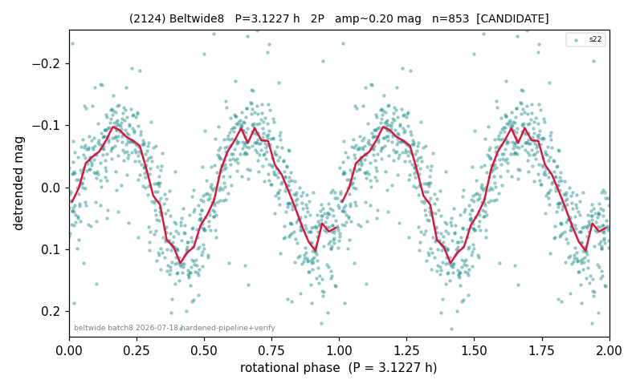

# (2124)

**Adopted:** 3.1227 h, 2P, CANDIDATE

<!-- AUTO:START (regenerated from pipeline outputs; do not hand-edit this block) -->
## Evidence (auto)

Detected in 1 sector(s):

| sector | N | baseline (h) | P_phot (h) | power | FAP | cycles | flags |
|--|--|--|--|--|--|--|--|
| s22 | 858 | 624.0 | 1.5621 | 0.4042 | 3.0e-92 | 399.5 | 2P-ambiguous |

- Pipeline refine said: **1P** (folded amp_fourier 0.165); flags: sick-dips-excised:s22(1)
- DIA (de-comb): survived(dPW=+3%,R2=0.56,s22@1.562h,1sec)
- Gates: FAP<1e-3 and power>=0.10 per detecting sector; single strong sector (candidate ceiling).
- **Adopted shape 2P OVERRIDES the pipeline's 1P** (doubling audit 2026-07-25: folded amplitude >= 0.25 mag, so a single-peaked curve is physically implausible; Harris convention -> 2P. The census 3-test doubling logic was measured at only 30% recall against 289 LCDB U>=2 ground-truth periods).

### Why this row reads the way it does

- REVIEW-FLAG: folded_amp=0.201. Single sector (s22) only -> CANDIDATE ceiling stands (pipeline correct there); but photometric period 1.5613h (FAP 5e-153, not a 328.8/n comb tooth, unaffected by the 1-point dip-excision) is below the 2.2h rubble-pile s

<!-- AUTO:END -->

## Reasoning
Single sector s22 (CANDIDATE ceiling). P_phot=1.5613 h (FAP 5e-153), ~15 km body sub-barrier -> physics-forced 2P/3.1227 h.
## Verdict
CANDIDATE 2P / 3.1227 h. Not promotable without a 2nd epoch.
