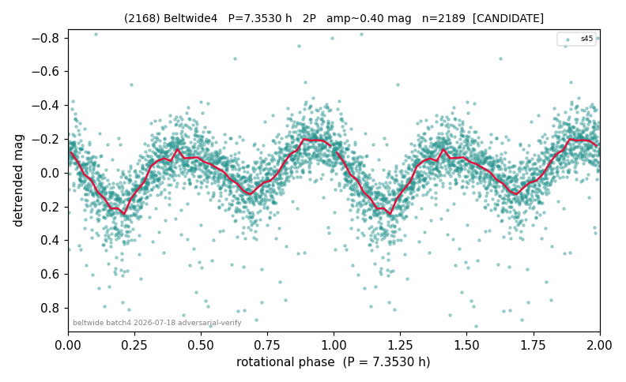

# (2168)

**Adopted:** 7.353 h, 2P, CANDIDATE

<!-- AUTO:START (regenerated from pipeline outputs; do not hand-edit this block) -->
## Evidence (auto)

Detected in 1 sector(s):

| sector | N | baseline (h) | P_phot (h) | power | FAP | cycles | flags |
|--|--|--|--|--|--|--|--|
| s45 | 2202 | 586.5 | 3.6762 | 0.3964 | 1.3e-236 | 79.8 | star-cleaned:227 |

- Pipeline refine said: **2P** (folded amp_fourier 0.407); flags: sick-dips-excised:s45(13);near-threshold:0.41
- DIA (de-comb): survived(dPW=+11%,R2=0.34,s45@3.676h,2sec)
- Coverage: **1 sector(s)**, best sector covers **79.77 cycles** of the adopted period. Measured periodogram peak width 1% of the period, i.e. about **+/- 0.009018 h** (1 sigma); the decimal places in the adopted value are not a precision claim.
- Factor of two: **adopted on the amplitude convention**: standard practice for an elongated body, but a convention rather than a measurement.
- Gates: FAP<1e-3 and power>=0.10 per detecting sector; single strong sector (candidate ceiling).
- Adopted shape: **2P** (folded-amplitude rule; pipeline agrees).

### Why this row reads the way it does

- LS on sector 45 (n=2202, baseline=586.6h) finds a dominant peak at P0=3.677h (power=0.396, FAP=1.1e-236), and independent PDM finds its global theta m
- 2P by amplitude rule (folded_amp=0.407)

<!-- AUTO:END -->
