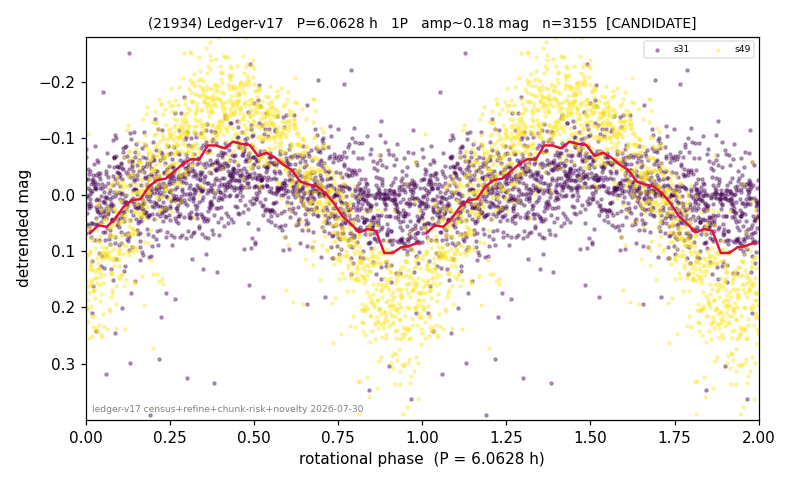

# (21934)

**Adopted:** 6.0628 h, 1P, CANDIDATE

<!-- AUTO:START (regenerated from pipeline outputs; do not hand-edit this block) -->
## Evidence (auto)

Detected in 2 sector(s):

| sector | N | baseline (h) | P_phot (h) | power | FAP | cycles | flags |
|--|--|--|--|--|--|--|--|
| s31 | 1671 | 389.8 | 6.0678 | 0.0892 | 6.2e-30 | 64.2 | star-cleaned:26 |
| s49 | 1497 | 403.8 | 6.0628 | 0.7727 | 0.0e+00 | 66.6 | 2P-ambiguous |

- Pipeline refine said: **1P** (folded amp_fourier 0.35); flags: sick-dips-excised:s49(1);near-threshold:0.35
- DIA (de-comb): **NOT RUN for this lot.** No de-comb verdict exists for this object, so momentum-dump contamination has not been excluded by that test here.
- Gates: FAP<1e-3 and power>=0.10 per detecting sector; single strong sector (candidate ceiling).
- Adopted shape: **1P** (folded-amplitude rule; pipeline agrees).

### Why this row reads the way it does

- 1 sector(s) detecting
- single-peaked at folded amp 0.350 mag

<!-- AUTO:END -->
