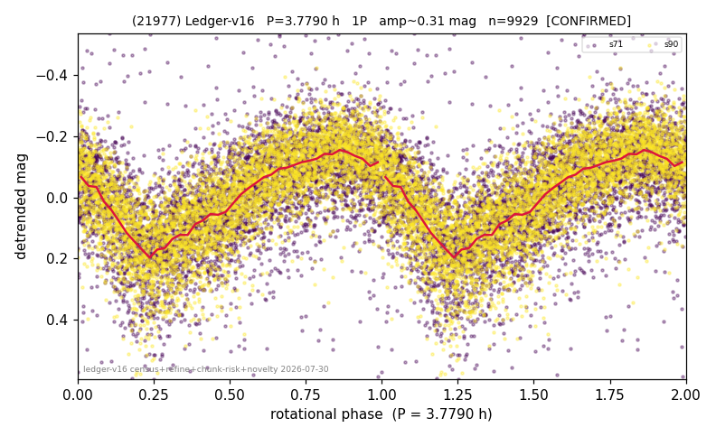

# (21977)

**Adopted:** 3.779 h, 1P, CONFIRMED

<!-- AUTO:START (regenerated from pipeline outputs; do not hand-edit this block) -->
## Evidence (auto)

Detected in 2 sector(s):

| sector | N | baseline (h) | P_phot (h) | power | FAP | cycles | flags |
|--|--|--|--|--|--|--|--|
| s71 | 5062 | 354.6 | 3.7781 | 0.3761 | 0.0e+00 | 93.9 | star-cleaned:99,2P-ambiguous |
| s90 | 4926 | 351.2 | 3.7791 | 0.5338 | 0.0e+00 | 92.9 | 2P-ambiguous |

- Pipeline refine said: **1P** (folded amp_fourier 0.321); flags: sick-dips-excised:s71(47)
- DIA (de-comb): **NOT RUN for this lot.** No de-comb verdict exists for this object, so momentum-dump contamination has not been excluded by that test here.
- Gates: FAP<1e-3 and power>=0.10 per detecting sector; >=2 sectors agree (harmonic-aware).
- Adopted shape: **1P** (folded-amplitude rule; pipeline agrees).

### Why this row reads the way it does

- 2 sector(s) detecting
- cross-sector fold correlation 0.97
- single-peaked at folded amp 0.321 mag

<!-- AUTO:END -->
