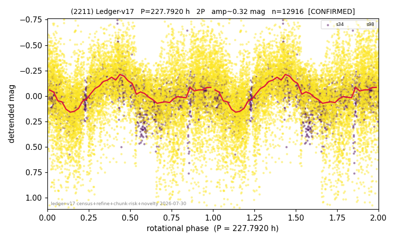

# (2211)

**Adopted:** 227.792 h, 2P, CONFIRMED

<!-- AUTO:START (regenerated from pipeline outputs; do not hand-edit this block) -->
## Evidence (auto)

Detected in 2 sector(s):

| sector | N | baseline (h) | P_phot (h) | power | FAP | cycles | flags |
|--|--|--|--|--|--|--|--|
| s34 | 2852 | 605.5 | 113.738 | 0.2448 | 2.9e-169 | 2.7 | star-cleaned:20 |
| s98 | 10101 | 812.0 | 114.0539 | 0.1629 | 0.0e+00 | 3.6 | star-cleaned:55 |

- Pipeline refine said: **2P** (folded amp_fourier 0.256); flags: amp-from-clean-sectors(ignored s98);audit-override:2P(odd-harm 4.3sig at 227.79h in direct
- DIA (de-comb): survived(dPW=+2%,R2=0.33,s34@113.896h,3sec)
- Coverage: **2 sector(s)**, best sector covers **3.56 cycles** of the adopted period. Measured periodogram peak width 11% of the period, i.e. about **+/- 5.31 h** (1 sigma); the decimal places in the adopted value are not a precision claim.
- Factor of two: **measured on the data** (odd-harmonic power or unequal minima, significant and reproduced), METHODOLOGY 3b.
- Gates: FAP<1e-3 and power>=0.10 per detecting sector; >=2 sectors agree (harmonic-aware).
- Adopted shape: **2P** (folded-amplitude rule; pipeline agrees).

### Why this row reads the way it does

- 2 sector(s) detecting
- cross-sector fold correlation 0.92
- doubling MEASURED: odd-harmonic power at 227.79 h at 4.3 sigma in the DIRECTLY extracted s34; both sectors independently give 227.5 and 228.1 h. Overrides the amplitude rule, which had halved it on amp 0.256 mag
- chunked sectors flagged (SUPPRESSED;BROKEN_CHUNK;AMP_DOMINATED;direct-sector-supported) but a directly extracted sector carries the period
- pipeline flag: audit-override
- pipeline flag: few-cycle
- pipeline flag: harmonic-only-agreement
- s34 re-extracted WITHOUT chunking 2026-08-06 and the power at the adopted period is retained (0.214->0.213, still the global peak): the period is verified on a direct curve. s98 REMAINS chunk-extracted: it is the 57-day double-length sector and its direct extraction exceeds available memory on both machines tried (3.2 GiB single allocation, 14281 cadences x 15074 pixels), which is the legitimate use case chunking exists for. One sector of two is therefore still chunked, and this flag stays TRUE

<!-- AUTO:END -->
