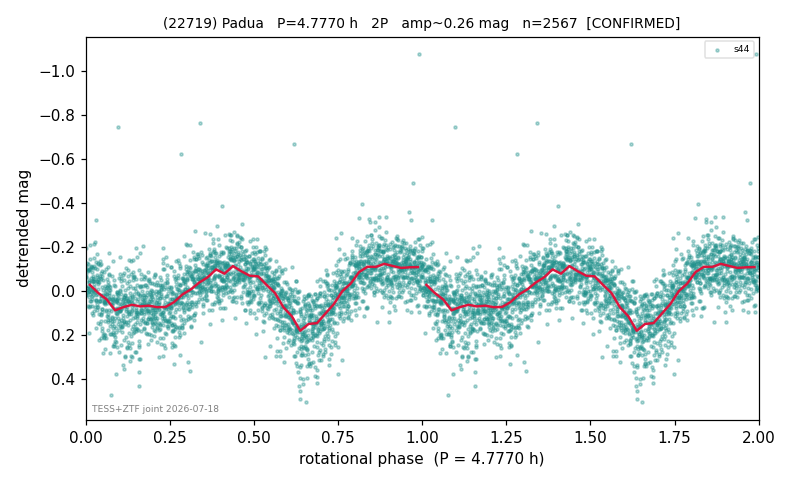

# (22719)

**Adopted:** 4.777 h, 2P, CONFIRMED

<!-- AUTO:START (regenerated from pipeline outputs; do not hand-edit this block) -->
## Evidence (auto)

Detected in 1 sector(s):

| sector | N | baseline (h) | P_phot (h) | power | FAP | cycles | flags |
|--|--|--|--|--|--|--|--|
| s44 | 2567 | 533.4 | 2.3884 | 0.4093 | 1.6e-288 | 223.3 | star-cleaned:16,2P-ambiguous |

- Refined shape: **1P** (folded amp_fourier 0.258); flags: clean
- DIA (de-comb): not triggered (clean, fast, non-comb)
- Gates: FAP<1e-3 and power>=0.10 per detecting sector; >=2 sectors agree (harmonic-aware); folded-amplitude rule -> 2P.

<!-- AUTO:END -->
