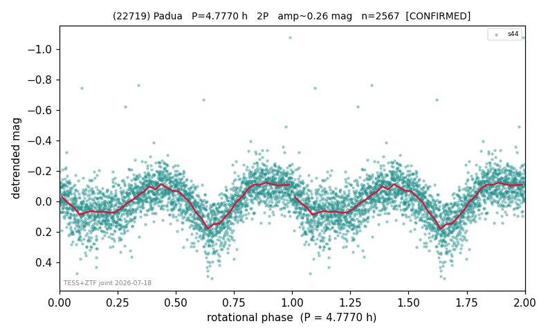

# (22719)

**Adopted:** 4.777 h, 2P, CONFIRMED

<!-- AUTO:START (regenerated from pipeline outputs; do not hand-edit this block) -->
## Evidence (auto)

Detected in 1 sector(s):

| sector | N | baseline (h) | P_phot (h) | power | FAP | cycles | flags |
|--|--|--|--|--|--|--|--|
| s44 | 2567 | 533.4 | 2.3884 | 0.4093 | 1.6e-288 | 223.3 | star-cleaned:16,2P-ambiguous |

- Pipeline refine said: **1P** (folded amp_fourier 0.258); flags: clean
- DIA (de-comb): not triggered (the object is clean, fast and non-comb, so the test does not apply)
- Gates: FAP<1e-3 and power>=0.10 per detecting sector; >=2 sectors agree (harmonic-aware).
- **Adopted shape 2P OVERRIDES the pipeline's 1P** (doubling audit 2026-07-25: folded amplitude >= 0.25 mag, so a single-peaked curve is physically implausible; Harris convention -> 2P. The census 3-test doubling logic was measured at only 30% recall against 289 LCDB U>=2 ground-truth periods).

### Why this row reads the way it does

- TESS single-sector + ZTF independent blind-recovery (FAP<<1e-8) = 2nd realization. TESS sector 44 alone is a clean, dominant, non-instrumental detection: LS power 0.41 at P_

<!-- AUTO:END -->
