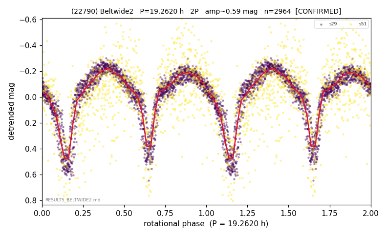

# (22790)

**Adopted:** 19.262 h, 2P, CONFIRMED

<!-- AUTO:START (regenerated from pipeline outputs; do not hand-edit this block) -->
## Evidence (auto)

Detected in 2 sector(s):

| sector | N | baseline (h) | P_phot (h) | power | FAP | cycles | flags |
|--|--|--|--|--|--|--|--|
| s29 | 1941 | 508.7 | 9.6477 | 0.7041 | 0.0e+00 | 52.7 | 2P-ambiguous |
| s51 | 1025 | 339.2 | 9.6143 | 0.252 | 9.5e-61 | 17.6 | star-cleaned:20 |

- Pipeline refine said: **2P** (folded amp_fourier 0.565); flags: sick-dips-excised:s51(2)
- DIA (de-comb): survived(dPW=+0%,R2=0.01,s29@9.631h,6sec)
- Gates: FAP<1e-3 and power>=0.10 per detecting sector; >=2 sectors agree (harmonic-aware).
- Adopted shape: **2P** (folded-amplitude rule; pipeline agrees).

### Why this row reads the way it does

- VIRGIN first det; clean 2/2 coherent, base 9.63h

<!-- AUTO:END -->
