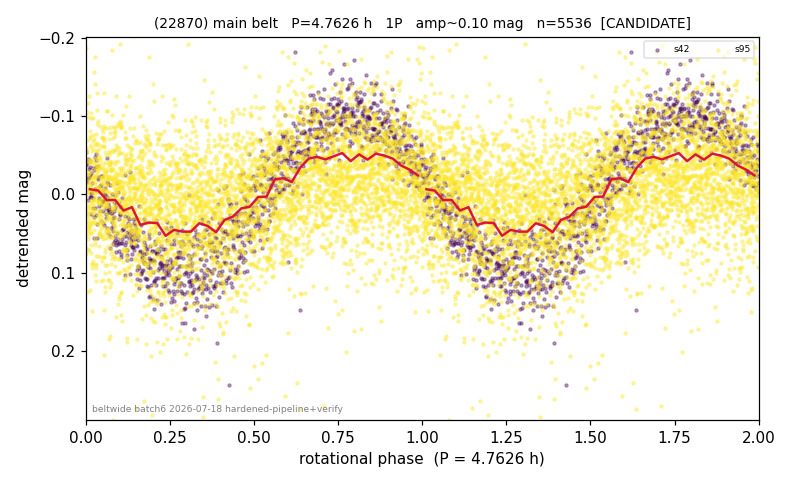

# (22870)

**Adopted:** 4.7626 h, 1P, CANDIDATE

<!-- AUTO:START (regenerated from pipeline outputs; do not hand-edit this block) -->
## Evidence (auto)

Detected in 2 sector(s):

| sector | N | baseline (h) | P_phot (h) | power | FAP | cycles | flags |
|--|--|--|--|--|--|--|--|
| s42 | 1186 | 220.5 | 4.7626 | 0.8323 | 0.0e+00 | 46.3 | 2P-ambiguous |
| s95 | 4376 | 324.1 | 4.7633 | 0.0935 | 8.0e-89 | 68.0 | star-cleaned:35 |

- Refined shape: **1P** (folded amp_fourier 0.231); flags: sick-dips-excised:s42(1)
- DIA (de-comb): survived(dPW=+13%,R2=0.25,s42@4.763h,4sec)
- Gates: FAP<1e-3 and power>=0.10 per detecting sector; single strong sector (candidate ceiling); folded-amplitude rule -> 1P.

<!-- AUTO:END -->
