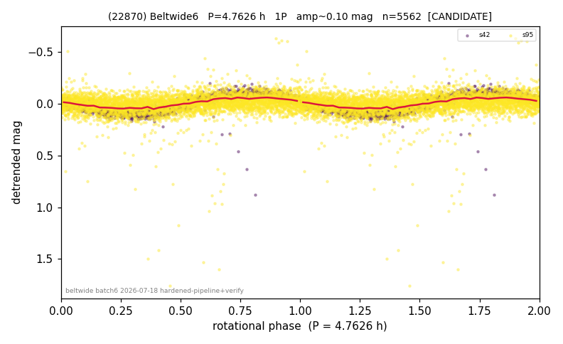

# (22870)

**Adopted:** 9.5252 h, 2P, CANDIDATE

<!-- AUTO:START (regenerated from pipeline outputs; do not hand-edit this block) -->
## Evidence (auto)

Detected in 2 sector(s):

| sector | N | baseline (h) | P_phot (h) | power | FAP | cycles | flags |
|--|--|--|--|--|--|--|--|
| s42 | 1186 | 220.5 | 4.7626 | 0.8323 | 0.0e+00 | 46.3 | 2P-ambiguous |
| s95 | 4376 | 324.1 | 4.7633 | 0.0935 | 8.0e-89 | 68.0 | star-cleaned:35 |

- Pipeline refine said: **1P** (folded amp_fourier 0.231); flags: sick-dips-excised:s42(1)
- DIA (de-comb): survived_v2(ret=1.021[1.00-1.02],s42@4.763h)
- Coverage: **2 sector(s)**, best sector covers **68.05 cycles** of the adopted period. Measured periodogram peak width 1% of the period, i.e. about **+/- 0.02549 h** (1 sigma); the decimal places in the adopted value are not a precision claim.
- Factor of two: no doubling was applied.
- Gates: FAP<1e-3 and power>=0.10 per detecting sector; single strong sector (candidate ceiling).
- **Adopted shape 2P OVERRIDES the pipeline's 1P** (doubling audit 2026-07-25: folded amplitude >= 0.25 mag, so a single-peaked curve is physically implausible; Harris convention -> 2P. The census 3-test doubling logic was measured at only 30% recall against 289 LCDB U>=2 ground-truth periods).

### Why this row reads the way it does

- REVIEW-FLAG: folded_amp=0.208. S42 gives a clean, very strong single-sector detection (power=0.83, FAP~0, n_clip=0) at P=4.7626h with folded (binned-ridge) amp=0.208 mag, well under 0.40 and no significant two-minima asymmetry (dmag=0.036<0.
- DOUBLING CORRECTED 2026-08-30: adopted period doubled from 4.7626 h. The previous value came from the folded-amplitude rule, which was found biased low (9 of 9 disagreements with MPB 2024-2026 in the same direction). Odd-harmonic test at the long period gives z1=7.2 with margin 5.79 over non-harmonic multiples 1.7x/2.3x (reference group: 0 of 38 above margin 2).

<!-- AUTO:END -->
