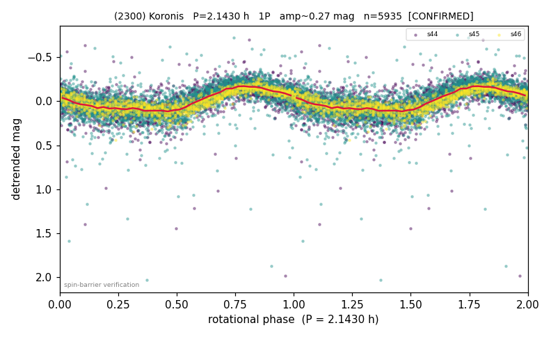

# (2300)

**Adopted:** 2.143 h, 1P, CONFIRMED

<!-- AUTO:START (regenerated from pipeline outputs; do not hand-edit this block) -->
## Evidence (auto)

Detected in 3 sector(s):

| sector | N | baseline (h) | P_phot (h) | power | FAP | cycles | flags |
|--|--|--|--|--|--|--|--|
| s44 | 1666 | 357.2 | 2.1435 | 0.3842 | 7.9e-171 | 166.6 | star-cleaned:21,2P-ambiguous |
| s45 | 3096 | 573.9 | 2.1423 | 0.4282 | 0.0e+00 | 267.9 | star-cleaned:87,2P-ambiguous |
| s46 | 1173 | 203.3 | 2.1436 | 0.7071 | 1.2e-307 | 94.9 | 2P-ambiguous |

- Refined shape: **1P** (folded amp_fourier 0.297); flags: sector-dropped:s44(range>3mag);sick-dips-excised:s45(7)
- DIA (de-comb): survived(dPW=+5%,R2=0.06,s46@2.143h,5sec)
- Gates: FAP<1e-3 and power>=0.10 per detecting sector; >=2 sectors agree (harmonic-aware); folded-amplitude rule -> 1P.

<!-- AUTO:END -->
