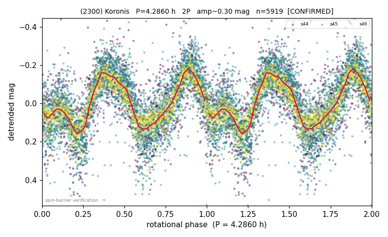

# (2300)

**Adopted:** 4.286 h, 2P, CONFIRMED

<!-- AUTO:START (regenerated from pipeline outputs; do not hand-edit this block) -->
## Evidence (auto)

Detected in 3 sector(s):

| sector | N | baseline (h) | P_phot (h) | power | FAP | cycles | flags |
|--|--|--|--|--|--|--|--|
| s44 | 1666 | 357.2 | 2.1435 | 0.3842 | 7.9e-171 | 166.6 | star-cleaned:21,2P-ambiguous |
| s45 | 3096 | 573.9 | 2.1423 | 0.4282 | 0.0e+00 | 267.9 | star-cleaned:87,2P-ambiguous |
| s46 | 1173 | 203.3 | 2.1436 | 0.7071 | 1.2e-307 | 94.9 | 2P-ambiguous |

- Pipeline refine said: **1P** (folded amp_fourier 0.297); flags: sick-dips-excised:s44(2),s45(7)
- DIA (de-comb): survived(dPW=+5%,R2=0.06,s46@2.143h,5sec)
- Gates: FAP<1e-3 and power>=0.10 per detecting sector; >=2 sectors agree (harmonic-aware).
- **Adopted shape 2P OVERRIDES the pipeline's 1P** (doubling audit 2026-07-25: folded amplitude >= 0.25 mag, so a single-peaked curve is physically implausible; Harris convention -> 2P. The census 3-test doubling logic was measured at only 30% recall against 289 LCDB U>=2 ground-truth periods).

### Why this row reads the way it does

- near-barrier (rho_crit 3.1 vs S-type ~2.7): doubling to 4.29h possible; flagged; P doubled 2026-07-25 (doubling audit: amp>=0.25 + Harris convention)

<!-- AUTO:END -->
