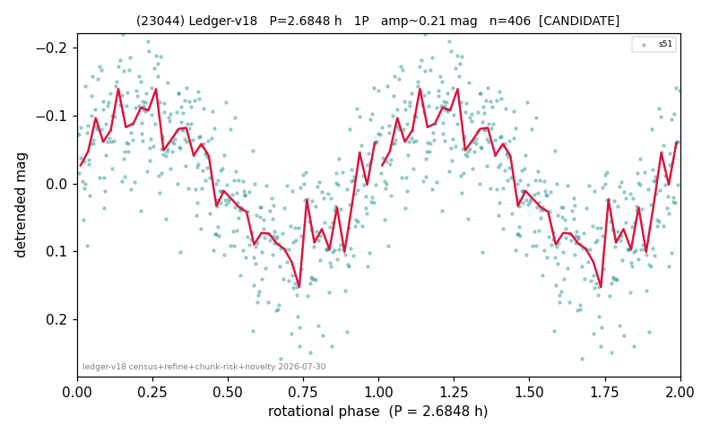

# (23044)

**Adopted:** 2.6848 h, 1P, CANDIDATE

<!-- AUTO:START (regenerated from pipeline outputs; do not hand-edit this block) -->
## Evidence (auto)

Detected in 1 sector(s):

| sector | N | baseline (h) | P_phot (h) | power | FAP | cycles | flags |
|--|--|--|--|--|--|--|--|
| s51 | 406 | 77.2 | 2.6848 | 0.6138 | 9.5e-80 | 28.7 | 2P-ambiguous |

- Pipeline refine said: **1P** (folded amp_fourier 0.232); flags: clean
- DIA (de-comb): not triggered (the object is clean, fast and non-comb, so the test does not apply)
- Coverage: **1 sector(s)**, best sector covers **28.74 cycles** of the adopted period. Measured periodogram peak width 3% of the period, i.e. about **+/- 0.03951 h** (1 sigma); the decimal places in the adopted value are not a precision claim.
- Factor of two: no doubling was applied.
- Gates: FAP<1e-3 and power>=0.10 per detecting sector; single strong sector (candidate ceiling).
- Adopted shape: **1P** (folded-amplitude rule; pipeline agrees).

### Why this row reads the way it does

- 1 sector(s) detecting
- single-peaked at folded amp 0.232 mag

<!-- AUTO:END -->
