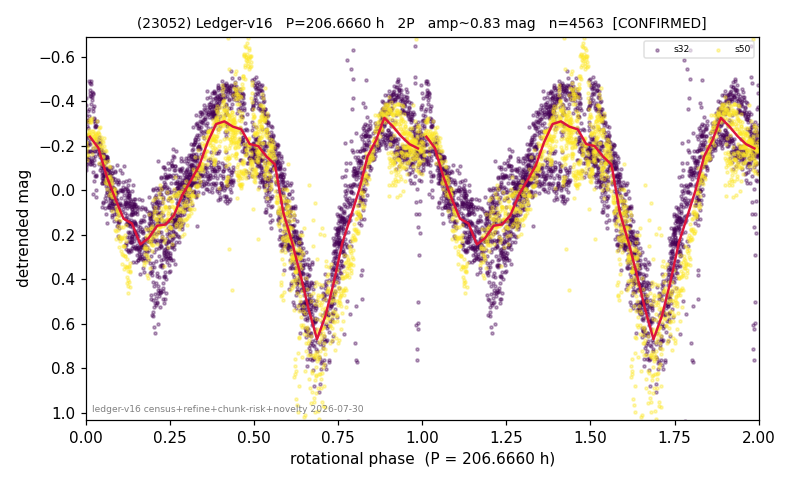

# (23052)

**Adopted:** 206.666 h, 2P, CANDIDATE

<!-- AUTO:START (regenerated from pipeline outputs; do not hand-edit this block) -->
## Evidence (auto)

Detected in 2 sector(s):

| sector | N | baseline (h) | P_phot (h) | power | FAP | cycles | flags |
|--|--|--|--|--|--|--|--|
| s32 | 2903 | 608.7 | 103.8067 | 0.67 | 0.0e+00 | 5.9 | star-cleaned:14,2P-ambiguous |
| s50 | 1671 | 537.0 | 102.8596 | 0.6824 | 0.0e+00 | 2.6 | star-cleaned:12 |

- Pipeline refine said: **2P** (folded amp_fourier 0.904); flags: few-cycle:2.9;gap-alias-risk:178h;sick-dips-excised:s32(6),s50(5)
- DIA (de-comb): survived(dPW=+6%,R2=0.05,s50@103.333h,5sec)
- Coverage: **2 sector(s)**, best sector covers **2.95 cycles** of the adopted period. Measured periodogram peak width 14% of the period, i.e. about **+/- 6.198 h** (1 sigma); the decimal places in the adopted value are not a precision claim.
- Factor of two: **adopted on the amplitude convention**: standard practice for an elongated body, but a convention rather than a measurement.
- Gates: FAP<1e-3 and power>=0.10 per detecting sector; single strong sector (candidate ceiling).
- Adopted shape: **2P** (folded-amplitude rule; pipeline agrees).

### Why this row reads the way it does

- 2 sector(s) detecting
- cross-sector fold correlation 0.95
- doubling BY CONVENTION: amplitude rule on folded amp 0.904 mag, not individually audited
- pipeline flag: few-cycle
- DOWNGRADED CONFIRMED->CANDIDATE 2026-08-16 (adversarial review): 2.60-2.95 cycles, no independent realization, dP/P = 17%

<!-- AUTO:END -->
