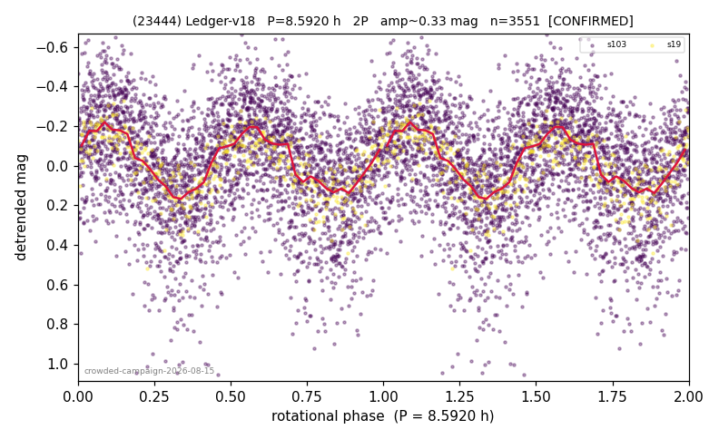

# (23444)

**Adopted:** 8.592 h, 2P, CONFIRMED

<!-- AUTO:START (regenerated from pipeline outputs; do not hand-edit this block) -->
## Evidence (auto)

Detected in 2 sector(s):

| sector | N | baseline (h) | P_phot (h) | power | FAP | cycles | flags |
|--|--|--|--|--|--|--|--|
| s19 | 433 | 346.0 | 4.2954 | 0.6138 | 2.6e-85 | 80.5 | 2P-ambiguous |
| s103 | 3146 | 249.5 | 4.2962 | 0.2046 | 8.5e-152 | 58.1 | 2P-ambiguous |

- Coverage: **2 sector(s)**, best sector covers **40.27 cycles** of the adopted period. Measured periodogram peak width 1% of the period, i.e. about **+/- 0.02203 h** (1 sigma); the decimal places in the adopted value are not a precision claim.
- Factor of two: **adopted on the amplitude convention**: standard practice for an elongated body, but a convention rather than a measurement.
- Gates: FAP<1e-3 and power>=0.10 per detecting sector; >=2 sectors agree (harmonic-aware).
- Adopted shape: **2P** (folded-amplitude rule; pipeline agrees).

### Why this row reads the way it does

- crowded-field campaign, adversarial review 2026-08-15: signal real (2/2 true detections at 4.296h, null 0/200, s19 offset +0.19 mag ok) but census 1P REFUTED by the amplitude rule: folded_amp 0.411/0.439 >= 0.40 -> doubling mandatory, adopted at 2x the census period
- 2P by amplitude rule
- DOUBLING RE-OPENED 2026-08-15 (adversarial review): the 0.411/0.439 mag that triggered the amplitude rule come from the biased max-minus-min-of-binned-medians estimator, whose noise floor on THIS curve is 0.301 mag on s19 (measured by phase randomisation). The unbiased Fourier peak-to-peak is 0.329 (s103) and 0.317 (s19), inside the 0.25-0.40 ambiguous band. The 2P period is retained by convention but the doubling is UNCONFIRMED and must be published as ambiguous

<!-- AUTO:END -->

## Reasoning
Adopted at 8.592 h = 2x the census period. The census 1P at 4.296 h is refuted by the folded-amplitude rule: folded amp 0.411/0.439 mag >= 0.40 makes doubling mandatory (Harris convention; the fold at 4.296 h would require a near-spherical body producing a 0.4 mag single hump). Signal itself is solid: 2/2 sectors with own peaks at 4.296 h, null-calibrated gate 0/200 false passes, s19 magnitude offset +0.19 mag consistent with geometry.
## Verdict
CONFIRMED 2P / 8.592 h.
