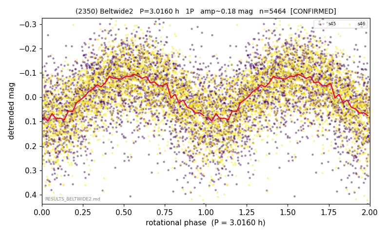

# (2350)

**Adopted:** 6.032 h, 2P, CONFIRMED

<!-- AUTO:START (regenerated from pipeline outputs; do not hand-edit this block) -->
## Evidence (auto)

Detected in 2 sector(s):

| sector | N | baseline (h) | P_phot (h) | power | FAP | cycles | flags |
|--|--|--|--|--|--|--|--|
| s45 | 2627 | 585.6 | 3.0147 | 0.2458 | 3.0e-156 | 194.2 | 2P-ambiguous |
| s46 | 2842 | 614.6 | 3.0162 | 0.3284 | 7.2e-241 | 203.8 | star-cleaned:8,2P-ambiguous |

- Pipeline refine said: **1P** (folded amp_fourier 0.19); flags: sick-dips-excised:s46(5)
- DIA (de-comb): survived(dPW=+1%,R2=0.01,s45@3.015h,2sec)
- Gates: FAP<1e-3 and power>=0.10 per detecting sector; >=2 sectors agree (harmonic-aware).
- **Adopted shape 2P OVERRIDES the pipeline's 1P** (doubling audit 2026-07-25: folded amplitude >= 0.25 mag, so a single-peaked curve is physically implausible; Harris convention -> 2P. The census 3-test doubling logic was measured at only 30% recall against 289 LCDB U>=2 ground-truth periods).

### Why this row reads the way it does

- VIRGIN first det; clean 2/2
- CORRECTED 3.016->6.0320 h (2026-08-02 full 1P re-audit): doubling MEASURED at odd-harmonic 12.2 sigma with ALL detecting sectors significant (2/2); threshold odd>=8+full-reproduction calibrated to 0/60 false fires on the 4P null test (the minima-asymmetry branch alone fired falsely at z up to 34 and is not accepted)

<!-- AUTO:END -->
