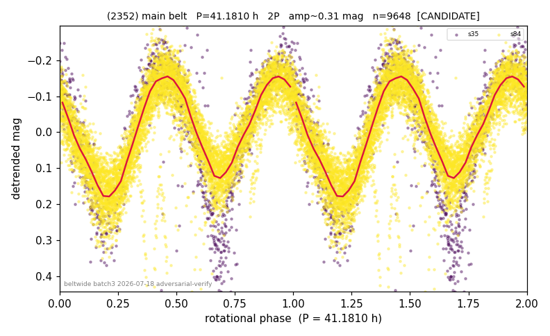

# (2352)

**Adopted:** 41.181 h, 2P, CANDIDATE

<!-- AUTO:START (regenerated from pipeline outputs; do not hand-edit this block) -->
## Evidence (auto)

Detected in 2 sector(s):

| sector | N | baseline (h) | P_phot (h) | power | FAP | cycles | flags |
|--|--|--|--|--|--|--|--|
| s35 | 1272 | 251.5 | 20.5633 | 0.7199 | 0.0e+00 | 12.2 | star-cleaned:11,2P-ambiguous |
| s84 | 8442 | 593.7 | 20.6176 | 0.6531 | 0.0e+00 | 14.4 | star-cleaned:4 |

- Refined shape: **2P** (folded amp_fourier 0.432); flags: near-comb(amp-cleared):n=8;sector-dropped:s84(range>3mag);sick-dips-excised:s35(7);near-th
- DIA (de-comb): survived(dPW=-11%,R2=0.06,s35@20.590h,3sec)
- Gates: FAP<1e-3 and power>=0.10 per detecting sector; single strong sector (candidate ceiling); folded-amplitude rule -> 2P.

<!-- AUTO:END -->
