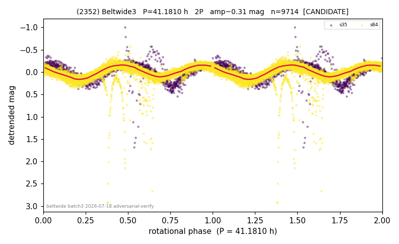

# (2352)

**Adopted:** 41.181 h, 2P, CANDIDATE

<!-- AUTO:START (regenerated from pipeline outputs; do not hand-edit this block) -->
## Evidence (auto)

Detected in 2 sector(s):

| sector | N | baseline (h) | P_phot (h) | power | FAP | cycles | flags |
|--|--|--|--|--|--|--|--|
| s35 | 1272 | 251.5 | 20.5633 | 0.7199 | 0.0e+00 | 12.2 | star-cleaned:11,2P-ambiguous |
| s84 | 8442 | 593.7 | 20.6176 | 0.6531 | 0.0e+00 | 14.4 | star-cleaned:4 |

- Pipeline refine said: **2P** (folded amp_fourier 0.432); flags: near-comb(amp-cleared):n=8;sick-dips-excised:s35(7),s84(27);near-threshold:0.43
- DIA (de-comb): survived_v2(ret=0.988[0.99-1.00],s35@20.590h)
- Coverage: **2 sector(s)**, best sector covers **14.42 cycles** of the adopted period. Measured periodogram peak width 3% of the period, i.e. about **+/- 0.2571 h** (1 sigma); the decimal places in the adopted value are not a precision claim.
- Factor of two: **adopted on the amplitude convention**: standard practice for an elongated body, but a convention rather than a measurement.
- Gates: FAP<1e-3 and power>=0.10 per detecting sector; single strong sector (candidate ceiling).
- Adopted shape: **2P** (folded-amplitude rule; pipeline agrees).

### Why this row reads the way it does

- census CONFIRMED downgraded: 2 sectors but agreement marginal
- 2P by amplitude rule (folded_amp=0.432)

<!-- AUTO:END -->
