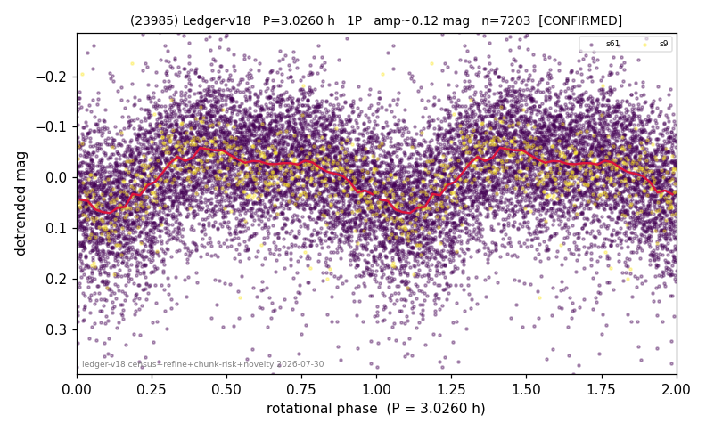

# (23985)

**Adopted:** 3.026 h, 1P, CONFIRMED

<!-- AUTO:START (regenerated from pipeline outputs; do not hand-edit this block) -->
## Evidence (auto)

Detected in 2 sector(s):

| sector | N | baseline (h) | P_phot (h) | power | FAP | cycles | flags |
|--|--|--|--|--|--|--|--|
| s9 | 556 | 387.5 | 3.0252 | 0.1777 | 3.4e-20 | 128.1 | star-cleaned:1 |
| s61 | 6679 | 470.3 | 3.0266 | 0.1461 | 4.3e-224 | 155.4 | star-cleaned:33,2P-ambiguous |

- Pipeline refine said: **1P** (folded amp_fourier 0.11); flags: sick-dips-excised:s61(16),s9(1)
- DIA (de-comb): survived(dPW=-6%,R2=0.14,s9@3.026h,3sec)
- Coverage: **2 sector(s)**, best sector covers **155.43 cycles** of the adopted period. Measured periodogram peak width 1% of the period, i.e. about **+/- 0.01 h** (1 sigma); the decimal places in the adopted value are not a precision claim.
- Factor of two: no doubling was applied.
- Gates: FAP<1e-3 and power>=0.10 per detecting sector; >=2 sectors agree (harmonic-aware).
- Adopted shape: **1P** (folded-amplitude rule; pipeline agrees).

### Why this row reads the way it does

- 2 sector(s) detecting
- cross-sector fold correlation 0.87
- single-peaked at folded amp 0.110 mag

<!-- AUTO:END -->
