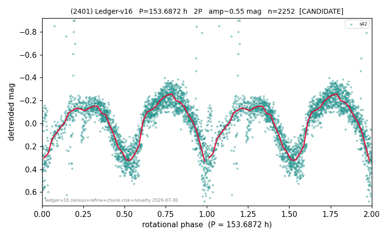

# (2401)

**Adopted:** 153.6872 h, 2P, CANDIDATE

<!-- AUTO:START (regenerated from pipeline outputs; do not hand-edit this block) -->
## Evidence (auto)

Detected in 1 sector(s):

| sector | N | baseline (h) | P_phot (h) | power | FAP | cycles | flags |
|--|--|--|--|--|--|--|--|
| s42 | 2257 | 589.9 | 76.8436 | 0.6422 | 0.0e+00 | 7.7 | star-cleaned:33,2P-ambiguous |

- Pipeline refine said: **2P** (folded amp_fourier 0.535); flags: few-cycle:3.8;gap-alias-risk:140h;sick-dips-excised:s42(5)
- DIA (de-comb): survived(dPW=-4%,R2=0.34,s42@76.844h,3sec)
- Coverage: **1 sector(s)**, best sector covers **3.84 cycles** of the adopted period. Measured periodogram peak width 10% of the period, i.e. about **+/- 3.376 h** (1 sigma); the decimal places in the adopted value are not a precision claim.
- Factor of two: **adopted on the amplitude convention**: standard practice for an elongated body, but a convention rather than a measurement.
- Gates: FAP<1e-3 and power>=0.10 per detecting sector; single strong sector (candidate ceiling).
- Adopted shape: **2P** (folded-amplitude rule; pipeline agrees).

### Why this row reads the way it does

- 1 sector(s) detecting
- doubling BY CONVENTION: symmetric fold at 0.57 mag amplitude
- pipeline flag: few-cycle

<!-- AUTO:END -->
